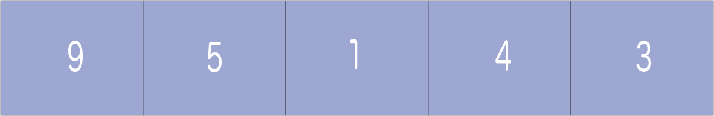
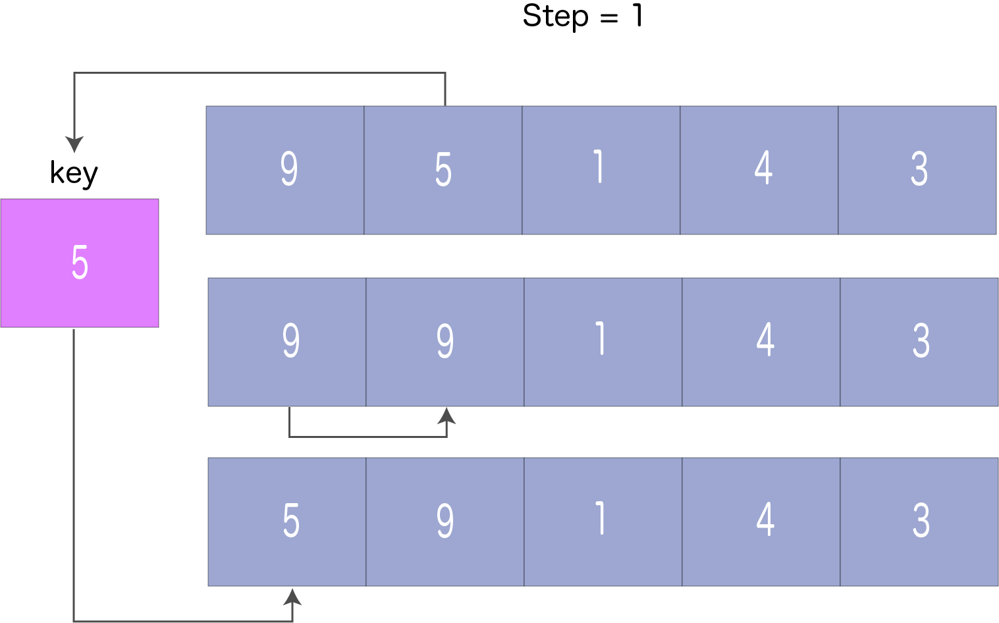
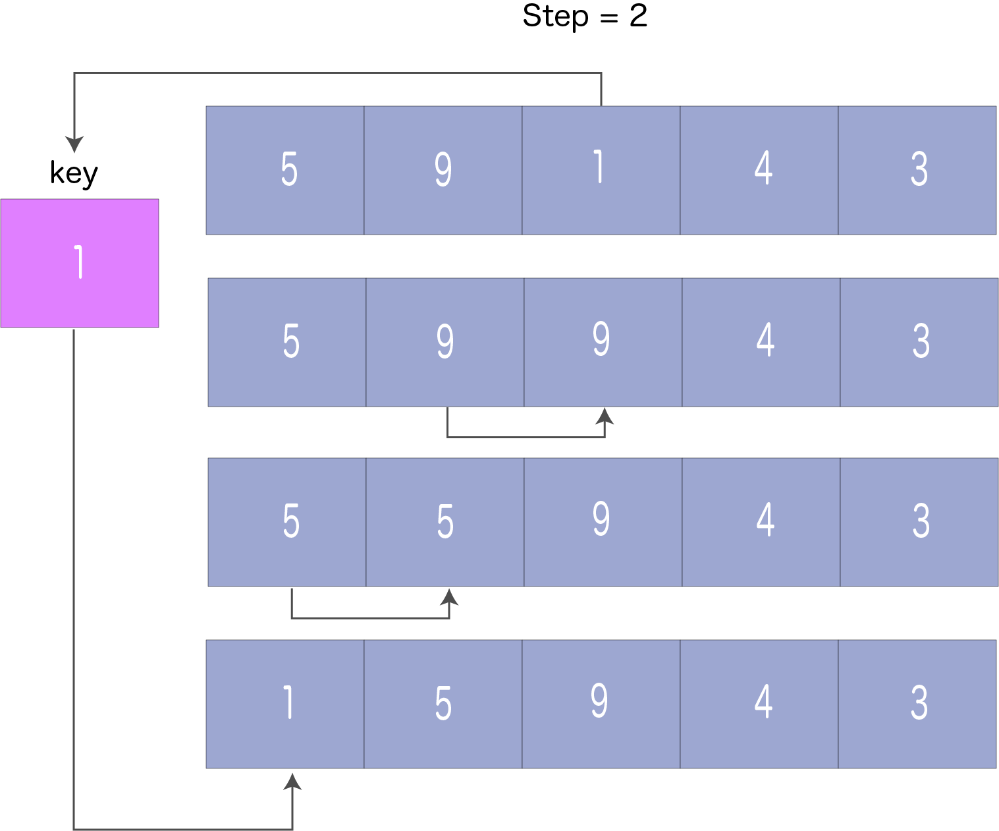
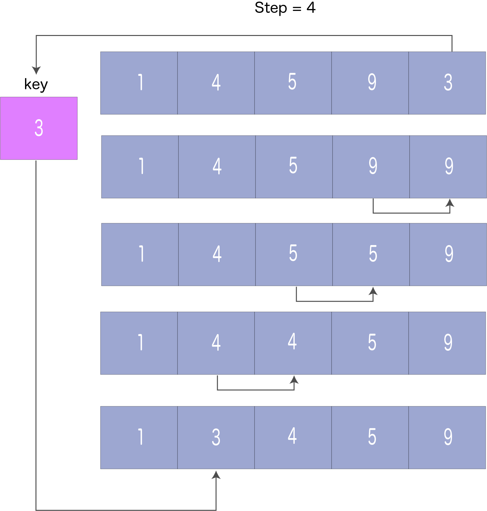

# Insertion Sort | 삽입 정렬
`삽입 정렬`은 카드 게임에서 카드를 손에 들고 정렬하는 것과 유사하게 작동한다.

첫 번째 카드는 이미 정렬이 된 것으로 가정하고 정렬되지 않은 카드를 선택한다. 그 카드가 손 안의 카드보다 크다면 오른쪽에, 그렇지 않다면 왼쪽에 놓는다. 동일한 방법으로, 다른 정렬되지 않은 카드들을 올바른 자리에 놓는다.

유사한 접근법이 삽입 정렬에 의해 사용된다.

삽입 정렬은 각 반복에서 정렬되지 않은 요소를 적절한 위치에 배치하는 정렬 알고리즘이다.

## 삽입 정렬의 작동 방식
다음 배열을 정렬해야 한다고 가정한다.


<br><br>

1. 배열의 첫 번째 요소는 정렬된 것으로 가정한다. 두 번째 요소를 취하여 따로 `key`에 보관한다.

`key`를 첫 번째 요소와 비교한다. 첫 번째 요소가 `key`보다 큰 경우, `key`를 첫 번째 요소의 앞에 배치한다.


<br><br>

2. 이제 처음 두 요소가 정렬되었다.

세 번째 요소를 그 왼쪽에 있는 요소와 비교하여 이보다 작은 요소 바로 뒤에 배치한다. 이보다 작은 요소가 없는 경우 배열의 시작 부분에 배치한다.


<br><br>

3. 마찬가지로 모든 정렬되지 않은 요소를 올바른 위치에 배치한다.


<br><br>


<br><br>

## 코드
```python
def insertionSort(array):
    for step in range(1, len(array)):
        key = array[step]
        j = step - 1

        while j >= 0 and key < array[j]:
            array[j + 1] = array[j]
            j = j - 1
        
        array[j + 1] = key


data = [9, 5, 1, 4, 3]
insertionSort(data)
print('Sorted Array in Ascending Order:')
print(data)
```
Output:
```
Sorted Array in Ascending Order:
[1, 3, 4, 5, 9]
```

## 복잡도
### 시간 복잡도
- 최악의 경우: `O(n^2)`
- 최선의 경우: `O(n)`
- 평균의 경우: `O(n^2)`

### 공간 복잡도
추가 변수 `key`가 사용되므로 공간 복잡도는 `O(1)`이다. 

## Reference
- https://www.programiz.com/dsa/insertion-sort