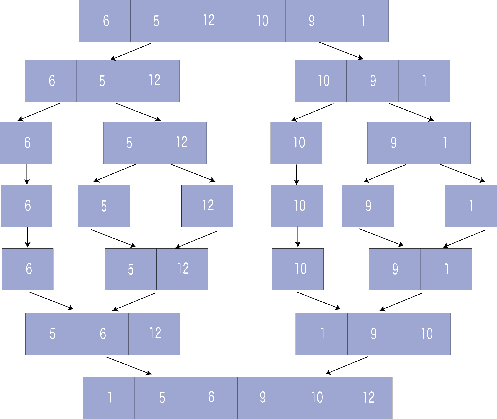

# Merge Sort | 병합 정렬
`병합 정렬`은 일종의 **분할 정복(Divide and Conquer)** 알고리즘이다. 입력 배열을 두 배열로 나누고, 두 배열에 대해 병합 정렬을 호출한 다음 두 정렬된 배열을 병합한다.

merge()함수는 두 배열을 병합하는 데 사용된다. merge(arr, l, m, r)은 arr[l...m]과 arr[m+1...r]이 정렬되어 두 개의 정렬된 하위 배열을 하나로 병합하는 핵심 프로세스이다.


<br><br>

## Divide and Conquer Strategy | 분할 정복 전략
분할 정복 기술을 사용하여 문제를 여러 하위 문제들로 나눈다. 각 하위 문제에 대한 솔루션이 준비되면, 하위 문제의 결과를 '결합'하여 주요 문제를 해결한다.

배열 `A`를 정렬해야 한다고 가정한다. 하위 문제는 이 배열의 인덱스 `p`부터 시작하여 `r`에서 끝나는 즉, `A[p..r]`로 표시되는 하위 섹션을 정렬하는 것이다.

### Divide | 분할
q가 p와 r 사이의 중간 지점이면 하위 배열 `A[p..r]`를 두 배열 `A[p..q]`와 `A[q+1, r]`로 나눌 수 있다.

### Conquer | 정복
정복 단계에서는 하위 배열 `A[p..q]`과 `A[q+1, r]`를 모두 정렬한다. 아직 base case에 도달하지 않은 경우 두 하위 배열을 다시 나누고 정렬을 시도한다.

### Combine | 결합
정복 단계가 base case에 도달하고, 배열 `A[p..r]`에 대하여 정렬된 두 하위 배열 `A[p..q]`과 `A[q+1, r]`을 얻는다면 두 개의 정렬된 하위 배열 `A[p..q]`과 `A[q+1, r]`로부터 정렬된 배열 `A[p..r]`을 만들어 결과를 결합한다.

## The MergeSort Algorithm
mergeSort()함수는 크기가 1인 하위 배열의 mergeSort()에 도달할 때까지 반복적으로 배열을 절반으로 나눈다. 

그런 다음, merge()함수가 작동하여 전체 배열이 병합될 때까지 정렬된 배열을 더 큰 배열로 결합한다.

```
MergeSort(A, p, r):
    if p > r 
        return
    q = (p+r)/2
    mergeSort(A, p, q)
    mergeSort(A, q+1, r)
    merge(A, p, q, r)
```

전체 배열을 정렬하기 위해서는 `mergeSort(A, 0, length(A)-1)`를 호출해야 한다.

### The merge Step of Merge Sort
모든 재귀 알고리즘은 base case와 이로부터의 결과를 결합하는 능력에 종속적이다. 병합 정렬도 다르지 않다. 병합 정렬의 가장 중요한 부분은 `merge` 단계이다.

`merge` 단계는 두 개의 정렬된 배열을 큰 하나의 정렬된 배열로 형성하는 방법이다.

## 코드
```python
def merge(arr, left, mid, right):
    fIdx = left
    rIdx = mid+1
    sIdx = left
    sortArr = [0]*(right+1)

    while fIdx <= mid and rIdx <= right:
        if arr[fIdx] <= arr[rIdx]:
            sortArr[sIdx] = arr[fIdx]
            fIdx += 1
        else:
            sortArr[sIdx] = arr[rIdx]
            rIdx += 1
        sIdx += 1

    if fIdx > mid:
        for i in range(rIdx, right+1):
            sortArr[sIdx] = arr[i]
            sIdx += 1
    else:
        for i in range(fIdx, mid+1):
            sortArr[sIdx] = arr[i]
            sIdx += 1
    
    for i in range(left, right+1):
        arr[i] = sortArr[i]

def mergeSort(arr, left, right):
    if left < right:
        mid = (left+right)//2

        mergeSort(arr, left, mid)
        mergeSort(arr, mid+1, right)

        merge(arr, left, mid, right)
       

def printList(array):
    for i in range(len(array)):
        print(array[i], end=" ")
    print()

if __name__ == '__main__':
    array = [6, 5, 12, 10, 9, 1]

    mergeSort(array, 0, len(array)-1)

    print("Sorted array is: ")
    printList(array)
```
Output:
```
Sorted array is: 
1 5 6 9 10 12
```

## 복잡도
### 시간 복잡도
* 최선의 경우: `O(n*log n)`
* 최악의 경우: `O(n*log n)`
* 평균의 경우: `O(n*log n)`

### 공간 복잡도
* `O(n)`

## 병합 정렬의 응용
* Inversion count problem
* External sorting
* E-commerce applications


## Reference
- https://www.programiz.com/dsa/merge-sort
- https://www.geeksforgeeks.org/merge-sort/