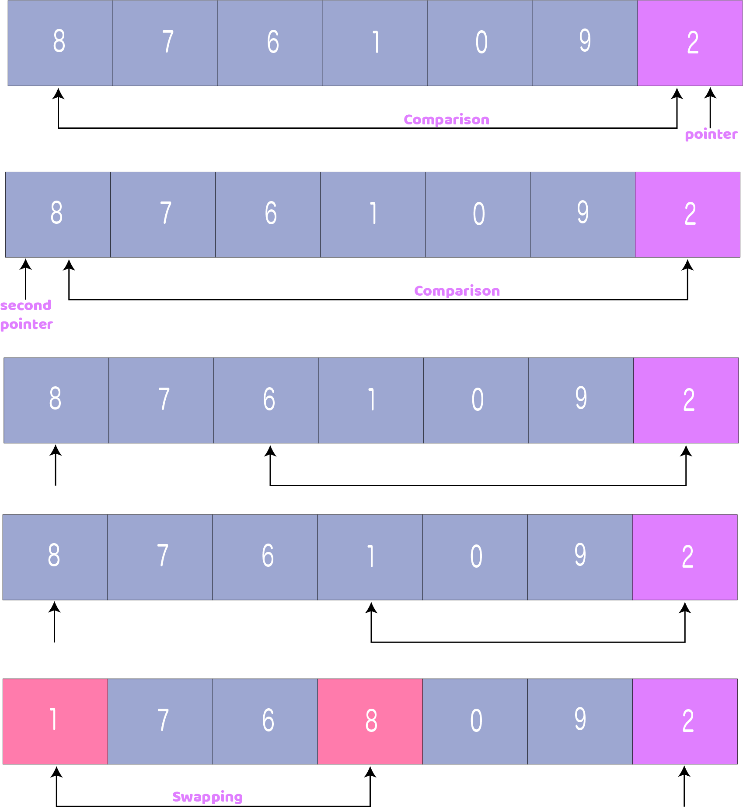
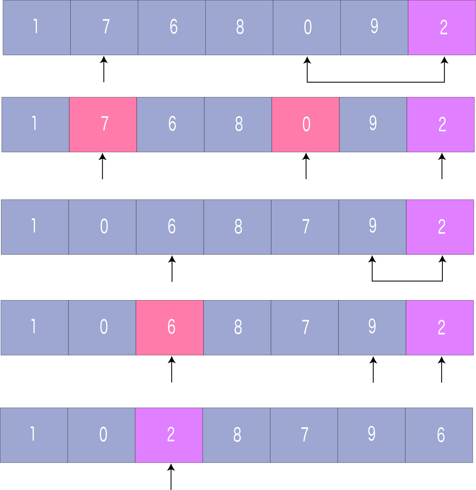

# Quick Sort | 퀵 정렬
`퀵 정렬`은 배열을 하위 배열로 분할하고 이러한 하위 배열들을 재귀적으로 호출하여 요소를 정렬하는 **분할 정복** 접근법에 기초한 알고리즘이다.

## 퀵 정렬은 어떻게 작동하는가?
1. **피벗** 요소는 배열에서 선택된다. 배열에 있는 모든 요소를 피벗 요소로 선택할 수 있다. 여기서는 배열의 가장 오른쪽, 즉 가장 마지막 요소를 피벗 요소로 정한다.


<br><br>

2. 피벗 요소보다 작은 요소는 왼쪽에 배치하고 피벗 요소보다 큰 요소는 오른쪽에 배치한다.


<br><br>

    위의 배열은 다음 단계에 의해 얻어진다.
    a. 포인터는 피벗 요소에 고정된다. 피벗 요소는 첫 번째 인덱스부터 시작하는 요소들과 비교된다. 피벗 요소보다 큰 요소에 도달하면 해당 요소에 대한 두 번째 포인터가 할당된다.
    b. 이제 피벗 요소는 다른 요소(세 번째 포인터)와 비교된다. 피벗 요소보다 작은 요소에 도달하면 더 작은 요소는 이전에 발견된 더 큰 요소와 교환된다.


<br><br>

    c. 이 과정은 두 번째 마지막 요소에 도달할 때까지 계속된다. 마지막으로, 피벗 요소는 두 번째 포인터와 교환된다.


<br><br>

    d. 이제 이 피벗 요소의 왼쪽 및 오른쪽 하위 파트는 아래 단계에서 추가 처리를 위해 취해진다.

3. 피벗 원소는 왼쪽 및 오른쪽 하위 파트에 대해 별도로 다시 선택된다. 이러한 하위 파트 내에서 피벗 요소는 올바른 위치에 배치된다. 그리고 나서, 2단계가 반복된다.

4. 하위 파트는 각 하위 파트가 단일 요소로 구성될 때까지 다시 작은 하위 파트로 분할된다.

5. 이 때, 배열은 이미 정렬되어 있다.

## 코드
```python
# 피벗 요소에 근거한 배열 분할 함수
def partition(array, low, high):
    # 피벗 요소 선택
    pivot = array[high]
    i = low - 1

    # 왼쪽보다 작은 요소를 피벗의 왼쪽에, 
    # 피벗보다 큰 요소를 피벗의 오른쪽에 배치한다.
    for j in range(low, high):
        if array[j] <= pivot:
            i = i + 1
            array[i], array[j] = array[j], array[i]

    array[i + 1], array[high] = array[high], array[i + 1]

    return i + 1


def quickSort(array, low, high):
    if low < high:
        # 피벗 위치를 선택하고 피벗보다 작은 모든 요소를 왼쪽에, 피벗보다 큰 모든 요소를 오른쪽에 배치한다
        pi = partition(array, low, high)

        # 피벗의 왼쪽 요소들을 정렬한다
        quickSort(array, low, pi - 1)

        # 피벗의 오른쪽 요소들을 정렬한다
        quickSort(array, pi + 1, high)


data = [8, 7, 2, 1, 0, 9, 6]
size = len(data)
quickSort(data, 0, size - 1)
print('Sorted Array in Ascending Order:')
print(data)
```
Output:
```
Sorted Array in Ascending Order:
[0, 1, 2, 6, 7, 8, 9]
```

## 복잡도
### 시간 복잡도
* 최악의 경우: `O(n^2)`
* 최선의 경우: `O(n*logn)`
* 평균의 경우: `O(n*logn)`

### 공간 복잡도
* `O(logn)`


## Reference
- https://www.programiz.com/dsa/quick-sort
