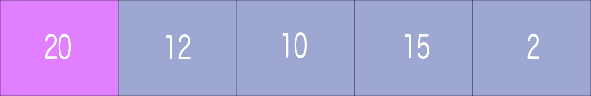
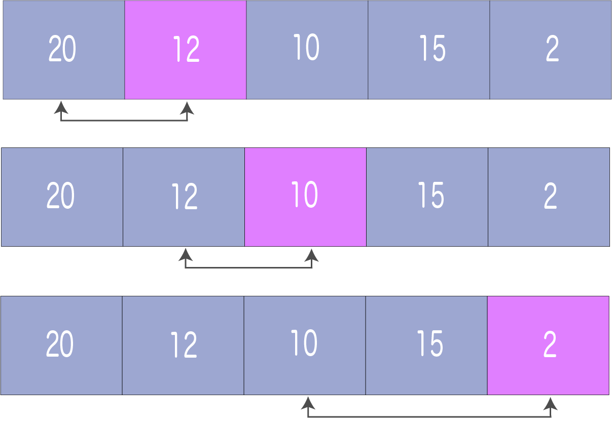
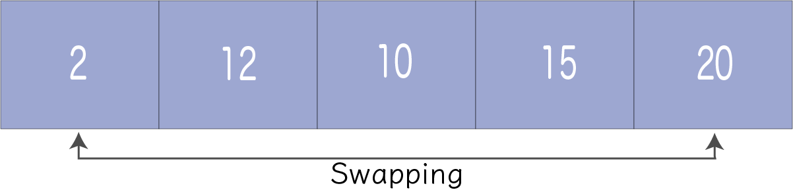
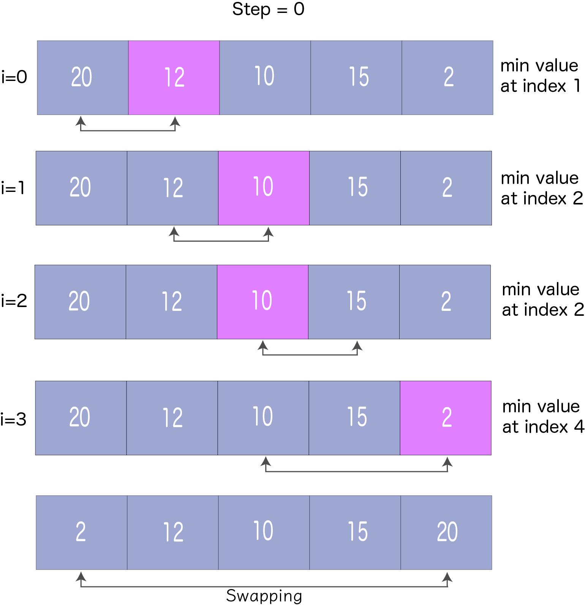
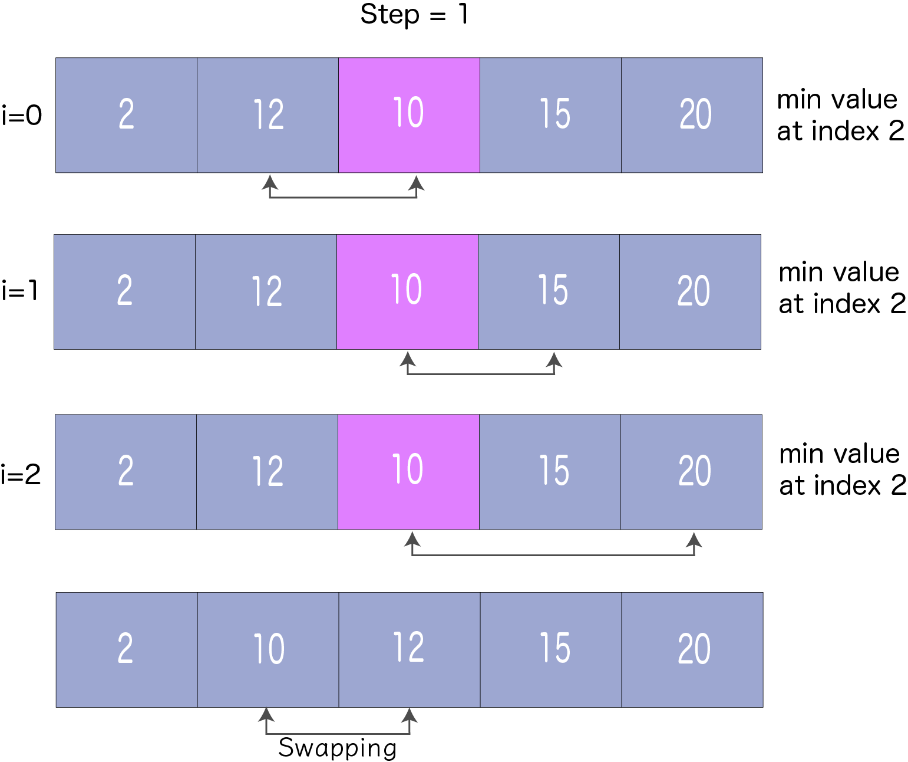
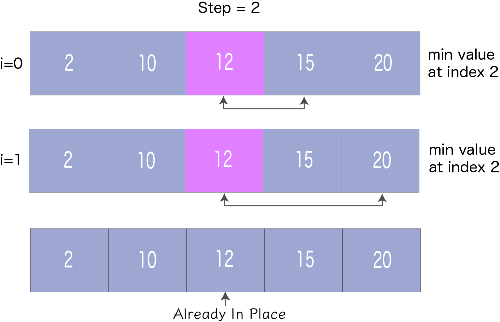
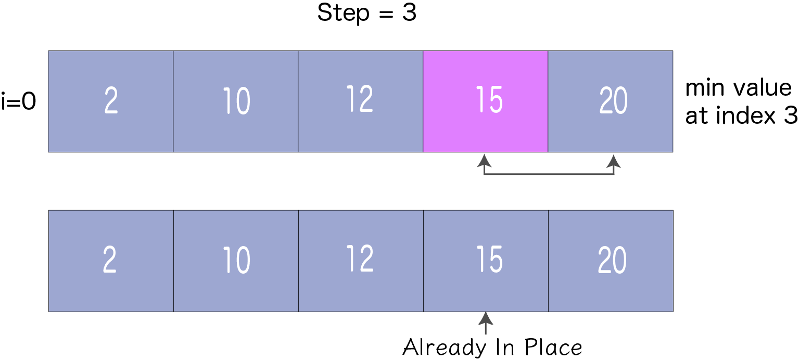

# Selection Sort | 선택 정렬
`선택 정렬`은 각 반복마다 정렬되지 않은 리스트 중 가장 작은 요소를 선택하여 정렬되지 않은 리스트의 시작 부분에 해당 요소를 배치하는 알고리즘이다.

## 선택 정렬의 작동 방식
1. 첫 번째 요소를 으로 `minimum`로 할당한다.


<br><br>

2. `minimum`을 두 번째 요소와 비교한다. 두 번째 요소가 `minimum`보다 작은 경우, 두 번째 요소를 `minimum`으로 할당한다.

`minimum`을 세 번째 요소와 비교한다. 다시, 세 번째 요소가 더 작은 경우, 세 번째 요소를 `minimum`으로 할당한다. 이 과정을 마지막 요소까지 반복한다.


<br><br>

3. 각 반복 후, `minimum`이 정렬되지 않은 리스트의 맨 앞에 놓여진다.


<br><br>

4. 각 반복 후, 인덱싱은 첫 번째 정렬되지 않은 요소부터 시작한다. 모든 요소가 올바른 위치에 배치될 때까지 1단계부터 3단계까지 반복된다.


<br><br>


<br><br>


<br><br>


<br><br>

## 선택 정렬 알고리즘
```
selectionSort(array, size)
  repeat (size - 1) times
  set the first unsorted element as the minimum
  for each of the unsorted elements
    if element < currentMinimum
      set element as new minimum
  swap minimum with first unsorted position
end selectionSort
```

## 코드
```python
def selectionSort(array):
    size = len(array)
    
    for step in range(size-1):
        min_idx = step
        for i in range(step+1, size):
            if array[i] < array[min_idx]:
                min_idx = i
        
        array[step], array[min_idx] = array[min_idx], array[step]

data = [-2, 45, 0, 11, -9]
selectionSort(data)
print("Sorted Array in Ascending Order : ")
print(data)
```
Output:
```bash
Sorted Array in Ascending Order : 
[-9, -2, 0, 11, 45]
```

## 복잡도
사이클 | 비교 횟수
------- | ------
1번째 | (n-1)
2번째 | (n-2)
3번째 | (n-3)
... | ...
마지막 | 1

<br>

**비교 횟수** = `(n-1) + (n-2) + (n-3) + ... + 1 = n(n-1)/2`으로 `n^2`과 거의 같다.

**복잡도** = `O(n^2)`

**시간 복잡도**:
- 최악의 경우: `O(n^2)`
- 최선의 경우: `O(n^2)`
- 평균의 경우: `O(n^2)`

선택 정렬의 시간 복잡도는 모든 경우에 동일하다. 단계마다 최소 요소를 찾아 올바른 위치에 놓아야 한다. 최소 요소는 배열 끝에 도달할 때까지 알 수 없다.

**공간 복잡도**:
공간 복잡도는 `O(1)`이다.


## Reference
- https://www.programiz.com/dsa/selection-sort