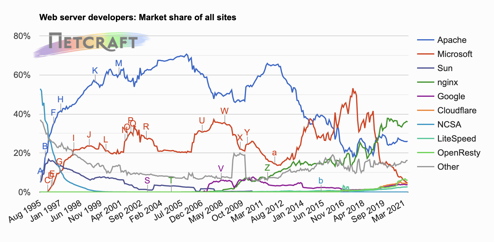

# 웹 서버

## 다채로운 웹 서버

* 웹 서버
    * HTTP 요청을 처리하고 응답을 제공
    * 웹 서버 소프트웨어, 웹페이지 제공에 특화된 장비 모두를 가리키는 용어
    * 기능, 형태, 크기가 다양(예: 짧은 펄 스크립트 웹 서버, 50메가바이트 상용 엔진, 작은 기판 위의 서버 등)

### 웹 서버 구현

* 웹 서버
    * HTTP 및 그와 관련된 TCP 처리를 구현
    * HTTP 프로토콜 구현, 웹 리소스 관리, 웹 서버 관리 기능 제공
    * TCP 커넥션 관리에 대한 책임을 운영체제와 나눠 갖는다

### 다목적 소프트웨어 웹 서버

**다목적 소프트웨어 웹 서버**는 *네트워크에 연결된 표준 컴퓨터 시스템에서 동작*한다. 아파치, W3C의 직소 같은 *오픈 소스 소프트웨어*를 사용할 수도 있고, 마이크로소프트나 아이플래닛의 웹 서버 같은 *상용 소프트웨어*를 사용할 수도 있다.


<br><br>

넷크래프트의 자동화된 조사에 의해 추정된 웹 서버 시장 점유율은 위와 같다. (cf. 책에는 2014년 기준으로 나와 있어 2021년 기준으로 추가하였음)

* 모든 인터넷 웹 사이트의 36%가 nginx 웹 서버를 통해 서비스되고 있다.
* 아파치 웹 서버가 점유율 26%를 차지하고 있다.
* 마이크로소프트 웹 서버는 2019년부터 점유율이 급격하게 감소하였다.

### 임베디드 웹 서버

**임베디드 웹 서버**는 *일반 소비자용 제품에 내장될 목적*으로 만들어진 작은 웹 서버이다. (예: 프린터, 가전제품)
이는 사용자가 기기를 간편한 웹 브라우저 인터페이스로 관리할 수 있게 해준다.

## 진짜 웹 서버가 하는 일

1. 커넥션을 맺는다
2. 요청을 받는다
3. 요청을 처리한다
4. 리소스에 접근한다
5. 응답을 만든다
6. 응답을 보낸다
7. 트랜잭션을 로그로 남긴다

## 단계 1: 클라이언트 커넥션 수락

### 새 커넥션 다루기

```
클라이언트가 웹 서버에 TCP 커넥션 요청 -> 웹 서버는 커넥션을 맺고 TCP 커넥션에서 IP 주소 호출 -> 어떤 클라이언트가 있는지 확인 -> 서버는 새 커넥션을 커넥션 목록에 추가
```

웹 서버는 어떤 커넥션이든 거절하거나 즉시 닫을 수 있다. 클라이언트의 IP 주소나 호스트명이 인가되지 않았거나 악의적이라고 알려진 경우 커넥션을 닫는다.

### 클라이언트 호스트명 식별

* 웹 서버는 '역방향 DNS(reverse DNS)'를 통해 클라이언트의 IP 주소를 호스트명으로 변환하여 구체적인 접근 제어와 로깅에 활용한다.
* 호스트명 룩업은 시간이 많이 걸릴 수 있어 웹 트랜잭션을 느려지게 할 수 있다.
* 대용량 웹 서버는 호스트명 분석을 꺼두거나 특정 콘텐츠에 대해서만 켜놓는다.

### ident를 통해 클라이언트 사용자 알아내기

몇몇 웹 서버는 IETF ident 프로토콜을 지원한다. 이는 서버에게 어떤 사용자 이름이 HTTP 커넥션을 초기화했는지 찾아낼 수 있게 해준다. 
클라이언트는 ident 결과를 위해 TCP 포트 113번을 listen한다.

* 클라이언트는 HTTP 커넥션을 연다.
* 서버는 커넥션을 클라이언트의 identd 서버 포트(113)를 향해 열고, 새 커넥션에 대응하는 사용자 이름을 묻는 요청을 보낸다.

## 단계 2: 요청 메시지 수신

요청 메시지를 파싱할 때 웹 서버가 하는 일은 다음과 같다.

* 요청줄을 파싱하여 요청 메서드, 리소스의 식별자(URI), 버전 번호를 찾는다. 요청줄은 CRLF로 끝난다.
* 메시지 헤더들을 읽는다. 각 메시지 헤더는 CRLF로 끝난다.
* 헤더의 끝을 의미하는 CRLF로 끝나는 빈 줄을 찾는다.
* 요청 본문이 있다면 읽어 들인다(길이는 Content-Length 헤더로 정의된다.)

### 메시지의 내부 표현

몇몇 웹 서버는 요청 메시지를 쉽게 다룰 수 있도록 내부의 자료 구조에 저장한다. 요청 메시지의 각 조각에 대한 포인터와 길이를 담을 수 있으며, 헤더는 속도가 빠른 룩업 테이블에 저장되어 각 필드에 신속하게 접근할 수 있을 것이다.

### 커넥션 입력/출력 처리 아키텍처

웹 서버들은 항상 새 요청을 주시하고 있다.

* 단일 스레드 웹 서버
    * 한 번에 하나씩 요청을 처리한다.
    * 처리 도중에 다른 커넥션은 무시된다.
* 멀티프로세스와 멀티스레드 웹 서버
    * 여러 요청을 동시에 처리하기 위해 여러 개의 프로세스 또는 고효율 스레드를 할당한다.
    * 스레드/프로세스는 필요할 때 만들어지거나 미리 만들어질 수 있다.
    * 많은 멀티스레드 웹 서비스가 스레드/프로세스 최대 개수에 제한을 둔다.
* 다중 I/O 서버
    * 대량의 커넥션 지원을 위해 웹 서버는 다중 아키텍처를 채택했다.
    * 모든 커넥션이 동시에 활동을 감시당한다.
    * 어떤 커넥션에 대해 작업을 수행하는 것은 그 커넥션에 실제로 해야 할 일이 있을 때뿐이다.
    * 스레드/프로세스는 유휴 상태의 커넥션에 매여 기다리느라 리소스를 낭비하지 않는다.

## 단계 3: 요청 처리

서버는 요청으로부터 메서드, 리소스, 헤더, 본문을 얻어내어 처리한다.

## 단계 4: 리소스의 매핑과 접근

웹 서버는 클라이언트에 콘텐츠를 전달하기 위해, 요청 메시지의 URI에 대응하는 콘텐츠나 콘텐츠 생성기를 웹 서버에서 찾아서 그 콘텐츠의 원천을 식별해야 한다.

### Docroot

* 리소스 매핑의 가장 단순한 형태: 요청 URI를 웹 서버의 파일 시스템 안에 있는 파일 이름으로 사용하는 것
* docroot: 웹 서버 파일 시스템의 특별한 폴더를 웹 콘텐츠를 위해 예약해 둔 폴더

httpd.conf 설정 파일에 DocumentRoot 줄을 추가하여 아파치 웹 서버의 문서 루트를 설정할 수 있다.
```
DocumentRoot /usr/local/httpd/files
```

### 디렉터리 목록

웹 서버는 디렉터리 URL에 대한 요청을 받을 수 있다.
이 경우 웹 서버는 다음과 같은 행동을 취할 수 있다.

* 에러 반환
* '색인 파일' 반환
* 디렉터리 탐색 후 그 내용을 담은 HTML 파일 반환

대부분의 웹 서버는 URL에 대응되는 디렉터리 안에서 `index.html` 파일을 찾아 반환한다. 

아파치 웹 서버에서 `DirectoryIndex` 설정 지시자를 사용해 기본 디렉터리 파일로 사용될 파일 이름의 집합을 설정할 수 있다. 

웹 서버는 자동으로 디렉터리의 파일들을 크기, 변경일 및 그 파일에 대한 링크와 함께 열거한 HTML 파일을 반환한다.

### 동적 콘텐츠 리소스 매핑

웹 서버는 URI를 **동적 리소스에 매핑**할 수 있다. **요청에 맞게 콘텐츠를 생성하는 프로그램에 URI를 매핑**하는 것이다. 웹 서버들 중 애플리케이션 서버는 웹 서버를 복잡한 백엔드 애플리케이션과 연결하는 일을 한다.

### 서버사이드 인클루드(Server-Side Includes, SSI)

많은 웹 서버가 서버사이드 인클루드를 지원한다. 서버는 리소스의 콘텐츠를 클라이언트에게 보내기 전에 처리한다.

### 접근 제어

웹 서버는 리소스에 접근 제어를 할당할 수 있다. 클라이언트의 IP 주소에 근거하여 접근을 제어하거나, 리소스에 접근하기 위한 비밀번호를 물어볼 수 있다.

## 단계 5: 응답 만들기

서버가 리소스를 식별하면, 요청 메서드로 서술되는 동작을 수행한 뒤 응답 메시지(응답 상태 코드, 응답 헤더, 응답 본문)를 반환한다.

### 응답 엔터티

트랜잭션이 응답 본문을 생성한다면, 응답 메시지와 함께 돌려 보낸다. 만약 본문이 있다면, 응답 메시지는 다음을 포함한다.

* Content-Type 헤더 (응답 본문의 MIME 타입 서술)
* Content-Length 헤더 (응답 본문의 길이 서술)
* 실제 응답 본문의 내용

### MIME 타입 결정

웹 서버는 응답 본문의 MIME 타입을 결정하는 책임을 갖는다.

* 웹 서버가 MIME 타입과 리소스를 연결하는 방법
    * mime.types
        * 파일 이름의 확장자 사용
        * 확장자별 MIME 타입이 담겨 있는 파일을 탐색
        * 가장 흔한 방법
    * 매직 타이핑(Magin typing)
        * 파일 내용을 검사해서 알려진 패턴에 대한 테이블에 해당하는 패턴이 있는지 찾아 본다
    * 유형 명시(Explicit typing)
        * 파일 확장자나 내용에 상관없이 어떤 MIME 타입을 갖도록 웹 서버를 설정할 수 있다
    * 유형 협상(Type negotiation)
        * 한 리소스가 여러 종류의 문서 형식에 속하도록 설정할 수 있다
        * 사용자와의 협상 과정을 통해 사용하기 가장 좋은 형식을 판별할 것인지 여부도 설정할 수 있다

### 리다이렉션

웹 서버는 요청을 수행하기 위해 브라우저가 다른 곳으로 가도록 리다이렉트 할 수 있다. 응답 코드는 3XX으로 지칭된다. Location 응답 헤더는 콘텐츠의 새로운 위치에 대한 URI를 포함한다.

* 영구히 리소스가 옮겨진 경우
    * 301 Moved Permanently
* 임시로 리소스가 옮겨진 경우
    * 303 See Other
    * 307 Temporary Redirect
* URL 증강
    * 문맥 정보를 포함시키기 위해 재 작성된 URL로 리다이렉트하는 경우
    * 303 See Other
    * 307 Temporary Redirect
* 부하 균형
    * 덜 부하가 걸린 서버로 리다이렉트
    * 303 See Other
    * 307 Temporary Redirect
* 친밀한 다른 서버가 있을 때
    * 클라이언트에 대한 정보를 갖고 있는 다른 서버로 리다이렉트
    * 303 See Other
    * 307 Temporary Redirect
* 디렉터리 이름 정규화
    * 클라이언트가 디렉터리 이름에 대한 URI를 요청하는데 끝에 빗금(/)을 빠뜨렸다면, 정상적으로 동작할 수 있도록 슬래시를 추가한 URI로 리다이렉트

## 단계 6: 응답 보내기

서버는 여러 클라이언트에 대한 많은 커넥션을 가질 수 있다. 서버는 커넥션 상태를 추적해야 하며 지속적인 커넥션은 특별히 주의해서 다룰 필요가 있다. 

## 단계 7: 로깅

트랜잭션 완료시 웹 서버는 트랜잭션이 어떻게 수행되었는지에 대한 로그를 로그파일에 기록한다.