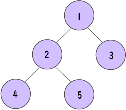
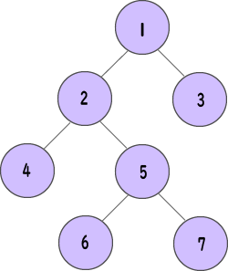
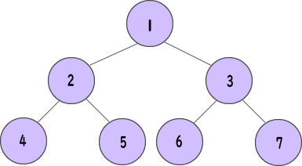
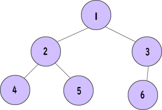
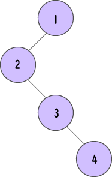
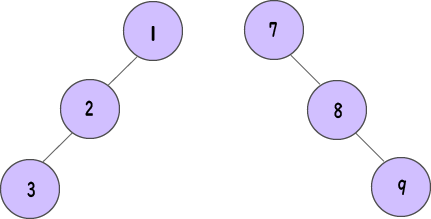
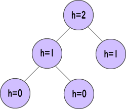

# Binary Tree | 이진 트리
```이진 트리```는 각 부모 노드가 **최대 두 개의 자식**을 가질 수 있는 트리 자료 구조이다.

EX. 아래 이미지에서 각 요소는 최대 두 개의 자식을 갖는다.


<br><br>

## 이진 트리의 종류
### Full Binary Tree | 정이진 트리
```정이진 트리```는 모든 부모 노드/내부 노드에 **자식 노드가 2개 또는 0개**인 특별한 유형의 이진 트리이다.


<br><br>

```python
# Checking if a binary tree is a full binary tree in Python

# Creating a node
class Node:
    def __init__(self, item):
        self.item = item
        self.leftChild = None
        self.rightChild = None

# Checking full binary tree
def isFullTree(root):
    # Tree empty case
    if root is None:
        return True
    
    # Checking whether child is present
    if root.leftChild is None and root.rightChild is None:
        return True

    if root.leftChild is not None and root.rightChild is not None:
        return (isFullTree(root.leftChild) and isFullTree(root.rightChild))
    
    return False


root = Node(1)
root.rightChild = Node(3)
root.leftChild = Node(2)

root.leftChild.leftChild = Node(4)
root.leftChild.rightChild = Node(5)
root.rightChild.leftChild.leftChild = Node(6)
root.rightChild.leftChild.rightChild = Node(7)

if isFullTree(root):
    print("The tree is a full binary tree")
else:
    print("The tree is not a full binary full")
```

### Perfect Binary Tree | 포화 이진 트리
```포화 이진 트리```는 모든 내부 노드에 정확히 **2개의 자식 노드**가 있고 모든 잎사귀 노드가 **동일한 레벨**에 있는 이진 트리의 유형이다.  


<br><br>

```python
# Checking if a binary tree is a perfect binary tree in Python
class newNode:
    def __init__(self, k):
        self.key = k
        self.right = None
        self.left = None

# Calculate the depth
def calculateDepth(node):
    d = 0
    while (node is not None):
        d += 1
        node = node.left
    return d

# Check if the tree is perfect binary tree
def isPerfect(root, d, level=0):
    # Check if the tree is empty
    if (root is None):
        return True

    # Check the presence of trees
    if (root.left is None and root.right is None):
        return (d == level + 1)

    if (root.left is None or root.right is None):
        return False

    return (is_perfect(root.left, d, level + 1) and
            is_perfect(root.right, d, level + 1))


root = None
root = newNode(1)
root.left = newNode(2)
root.right = newNode(3)
root.left.left = newNode(4)
root.left.right = newNode(5)

if (isPerfect(root, calculateDepth(root))):
    print("The tree is a perfect binary tree")
else:
    print("The tree is not a perfect binary tree")
```


### Complete Binary Tree | 완전 이진 트리
```완전 이진 트리```는 정이진 트리와 비슷하지만, 아래와 같은 차이점이 있다.

1. 모든 레벨은 완전히 채워져야 한다.
1. 모든 잎사귀 요소는 **왼쪽으로 기울어져야** 한다.
1. 마지막 잎사귀 요소에는 **오른쪽 형제 노드가 없을 수 있다**. 즉, 완전 이진 트리가 정이진 트리일 필요는 없다.


<br><br>

```python
# Checking if a binary tree is a complete binary tree in Python
class Node:
    def __init__(self, item):
        self.item = item
        self.left = None
        self.right = None

# Count the number of nodes
def count_nodes(root):
    if root is None:
        return 0
    return (1 + count_nodes(root.left) + count_nodes(root.right))

# Check if the tree is complete binary tree
def is_complete(root, index, numberNodes):
    # Check if the tree is empty
    if root is None:
        return True

    if index >= numberNodes:
        return False

    return (is_complete(root.left, 2 * index + 1, numberNodes)
            and is_complete(root.right, 2 * index + 2, numberNodes))


root = Node(1)
root.left = Node(2)
root.right = Node(3)
root.left.left = Node(4)
root.left.right = Node(5)
root.right.left = Node(6)

node_count = count_nodes(root)
index = 0

if is_complete(root, index, node_count):
    print("The tree is a complete binary tree")
else:
    print("The tree is not a complete binary tree")
```

### Degenerate or Pathological Tree | 변질 트리
```변질 트리```는 왼쪽 또는 오른쪽에 **오직 하나의 자식 노드**를 갖는 트리이다.


<br><br>

### Skewed Binary Tree | 편향 이진 트리
```편향 이진 트리```는 **왼쪽 또는 오른쪽 노드에 의해 지배**되는 변질 트리이다. 따라서, 편향 이진 트리는 좌편향 이진 트리, 우편향 이진 트리의 두 가지 종류가 있다.


<br><br>

### Balanced Binary Tree | 균형 이진 트리
```균형 이진 트리```는 각 노드의 왼쪽과 오른쪽 하위 트리의 **차이가 0 또는 1**인 이진 트리의 종류이다.


<br><br>

```python
# Checking if a binary tree is CalculateHeight balanced in Python
class Node:
    def __init__(self, item):
        self.item = item
        self.left = None
        self.right = None

# Calculate height
class CalculateHeight:
    def __init__(self):
        self.CalculateHeight = 0

# Check height balance
def is_height_balanced(root, CalculateHeight):
    left_height = CalculateHeight()
    right_height = CalculateHeight()

    if root is None:
        return True

    l = is_height_balanced(root.left, left_height)
    r = is_height_balanced(root.right, right_height)

    CalculateHeight.CalculateHeight = max(
        left_height.CalculateHeight, right_height.CalculateHeight) + 1

    if abs(left_height.CalculateHeight - right_height.CalculateHeight) <= 1:
        return l and r

    return False


CalculateHeight = CalculateHeight()

root = Node(1)
root.left = Node(2)
root.right = Node(3)
root.left.left = Node(4)
root.left.right = Node(5)

if is_height_balanced(root, CalculateHeight):
    print('The tree is balanced')
else:
    print('The tree is not balanced')
```

## 이진 트리 표현
이진 트리의 노드는 다른 노드에 대한 두 개의 포인터와 데이터 부분을 포함하는 구조로 표현된다.

```python
class Node:
    def __init__(self, key):
        self.left = None
        self.right = None
        self.val = key
```


## 코드 예시
```python
# Binary Tree in Python
class Node:
    def __init__(self, key):
        self.left = None
        self.right = None
        self.val = key

    # Traverse preorder
    def traversePreOrder(self):
        print(self.val, end=' ')
        if self.left:
            self.left.traversePreOrder()
        if self.right:
            self.right.traversePreOrder()

    # Traverse inorder
    def traverseInOrder(self):
        if self.left:
            self.left.traverseInOrder()
        print(self.val, end=' ')
        if self.right:
            self.right.traverseInOrder()

    # Traverse postorder
    def traversePostOrder(self):
        if self.left:
            self.left.traversePostOrder()
        if self.right:
            self.right.traversePostOrder()
        print(self.val, end=' ')


root = Node(1)

root.left = Node(2)
root.right = Node(3)

root.left.left = Node(4)

print("Pre order Traversal: ", end="")
root.traversePreOrder()
print("\nIn order Traversal: ", end="")
root.traverseInOrder()
print("\nPost order Traversal: ", end="")
root.traversePostOrder()
```
Output:
```bash
Pre order Traversal: 1 2 4 3 
In order Traversal: 4 2 1 3 
Post order Traversal: 4 2 3 1
```

## 이진 트리의 활용
- 쉽고 빠른 데이터 접근
- 라우터 알고리즘
- 힙 자료 구조 구현
- 구문 트리


## Reference
- https://www.programiz.com/dsa/binary-tree