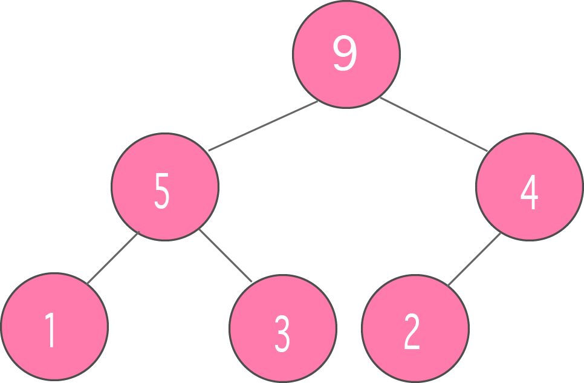
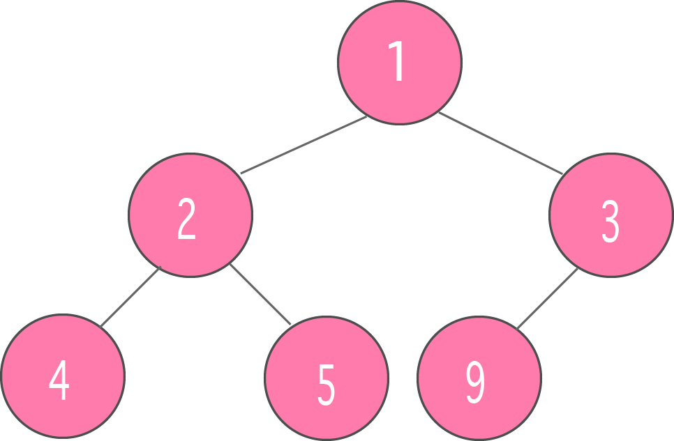
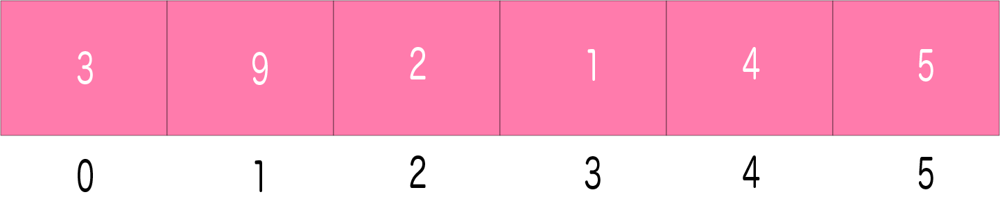
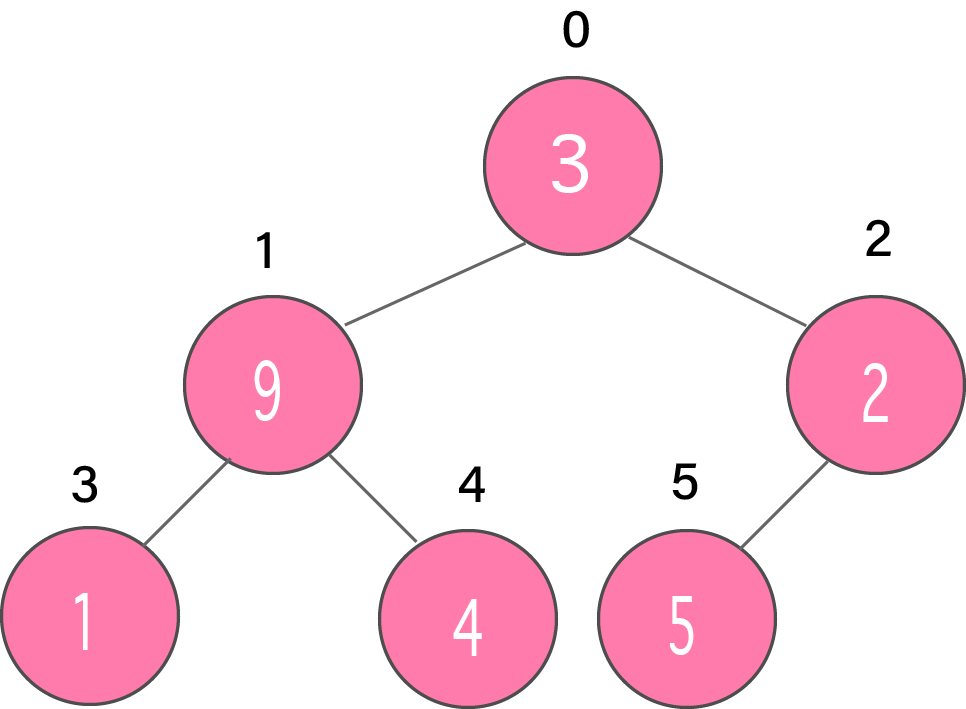
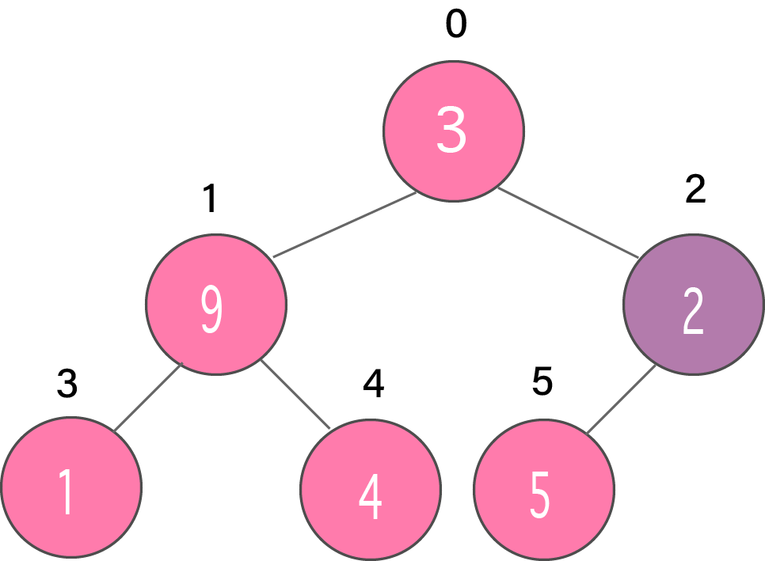
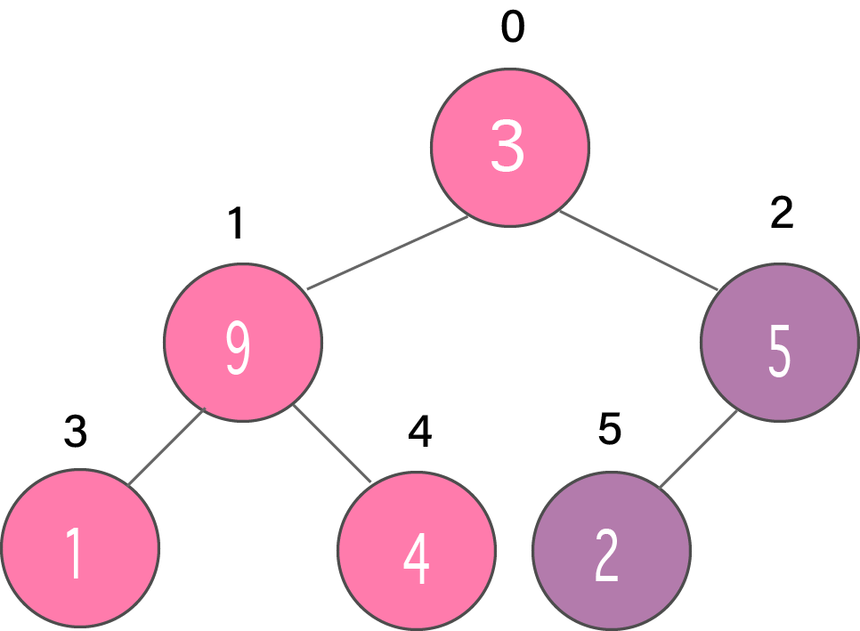

# Heap | 힙
`힙 자료 구조`는 **힙 속성**을 충족하는 **완전 이진 트리**(Complete Binary Tree)이다. `이진 힙`이라고도 한다.

완전 이진 트리는 다음과 같은 특별한 이진 트리이다.
- 마지막 레벨을 제외한 모든 레벨이 채워진다.
- 모든 노드가 가능한 한 왼쪽으로 채워진다.

힙 속성은 다음과 같은 노드의 속성을 갖는 것을 의미한다.
- 최대 힙(max heap): 각 노드의 데이터가 항상 자식 노드보다 크며 루트 노드의 데이터는 모든 노드 중 가장 크다.
<br>

<br><br>

- 최소 힙(min heap): 각 노드의 데이터가 항상 자식 노드보다 작으며 루트 노드의 데이터는 모든 노드 중 가장 작다.
<br>

<br><br>

## Heapify
`Heapify`는 이진 트리로부터 힙 자료 구조를 생성하는 과정이다. 최소 힙 또는 최대 힙을 생성하기 위해 사용된다.

1. 입력 배열을 다음과 같이 둔다.
<br>

<br><br>

2. 배열에서 완전 이진 트리를 생성한다.
<br>

<br><br>

3. 인덱스가 `n/2 - 1`인 비잎사귀 노드의 첫 번째 인덱스로 부터 시작해보자.
<br>

<br><br>

4. 현재 요소 `i`를 `largest`로 설정한다.
5. 왼쪽 자식의 인덱스는 `2i + 1`, 오른쪽 자식의 인덱스는 `2i + 2`이다.
`leftChild`가 `currentElement`보다 크다면 (i.e. `ith` 인덱스의 요소), `leftChildIndex`를 `largest`로 설정한다.
`rightChild`가 `largest`의 요소보다 크다면, `rightChildIndex`를 `largest`로 설정한다.
6. `largest`와 `currentElement`를 교환한다.
<br>

<br><br>

7. 하위 트리들이 heapify될 때까지 3-7 단계를 반복한다. 

## 최소 힙 구현
힙의 요소를 배열로 매핑하는 작업은 간단하다. 노드가 인덱스 `k`에 저장되면 해당 노드의 왼쪽 자식 노드는 인덱스 `2k`+1에 저장되고 오른쪽 자식 노드는 인덱스 `2k+2`에 저장된다.

### 최소 힙의 표현
`최소 힙`은 완전 이진 트리(Complete binary tree)이다. 최소 힙은 일반적으로 배열로 표현된다. 루트 요소는 arr[0]에 있을 것이다. 즉, i번째 노드는 arr[i]에 있을 것이다.

- **arr[(i-1)/2]**: 부모 노드
- **arr[(2*i)+1]**: 왼쪽 자식 노드
- **arr[(2*i)+2]**: 오른쪽 자식 노드

### 최소 힙의 연산
- **getMin()**: 최소 힙의 루트를 반환한다. 시간 복잡도는 **O(1)**이다.
- **extractMin()**: 최소 힙에서 최소 값 요소를 삭제한다. 루트 삭제 후 heapify()를 호출하며 힙 속성을 유지해야 하므로 시간 복잡도는 **O(logn)**이다. 
- **insert()**: 새로운 키를 삽입하는 작업은 **O(logn)**의 시간 복잡도를 갖는다. 트리의 맨 끝에 키를 추가한다. 새로운 키가 부모보다 큰 경우는 아무 것도 할 필요가 없다. 그렇지 않은 경우, 훼손된 힙 속성을 고치기 위해 다각도로 순회하여야 한다.

### 코드
```python
import sys
class MinHeap:
    def __init__(self, maxsize):
        self.maxsize = maxsize
        self.size = 0
        self.Heap = [0]*(self.maxsize + 1)
        self.Heap[0] = -1 * sys.maxsize
        self.FRONT = 1

    def parent(self, pos):
        return pos//2

    def leftChild(self, pos):
        return 2*pos

    def rightChild(self, pos):
        return (2*pos) + 1

    def isLeaf(self, pos):
        if pos >= (self.size//2) and pos <= self.size:
            return True
        return False

    def swap(self, fpos, spos):
        self.Heap[fpos], self.Heap[spos] = self.Heap[spos], self.Heap[fpos]

    def minHeapify(self, pos):
        # 비잎사귀노드이고 더 작은 자식노드가 존재하는 경우
        if (not self.isLeaf(pos) and
            (self.Heap[pos] > self.Heap[self.leftChild(pos)] or
            self.Heap[pos] > self.Heap[self.rightChild(pos)])):
                # 왼쪽 자식 노드와 교환한 후 왼쪽 자식 노드를 heapify한다
                if self.Heap[self.leftChild(pos)] < self.Heap[self.rightChild(pos)]:
                    self.swap(pos, self.leftChild(pos))
                    self.minHeapify(self.leftChild(pos))
                # 오른쪽 자식 노드와 교환한 후 오른쪽 자식 노드를 heapify한다
                else:   
                    self.swap(pos, self.rightChild(pos))
                    self.minHeapify(self.rightChild(pos))

    def insert(self, element):
        if self.size >= self.maxsize:
            return
        self.size += 1
        self.Heap[self.size] = element
        
        current = self.size

        while self.Heap[current] < self.Heap[self.parent(current)]:
            self.swap(current, self.parent(current))
            current = self.parent(current)

    def Print(self):
        for i in range(1, (self.size//2)+1):
            print("Parent : " +str(self.Heap[i]) + "  Left child : " + str(self.Heap[2*i]) + "  Right child : ", str(self.Heap[2*i + 1]))

    def minHeap(self):
        for pos in range(self.size//2, 0, -1):
            self.minHeapify(pos)

    def remove(self):
        popped = self.Heap[self.FRONT]
        self.Heap[self.FRONT] = self.Heap[self.size]
        self.size -= 1
        self.minHeapify(self.FRONT)
        return popped

if __name__ == "__main__":
    minHeap = MinHeap(15)
    minHeap.insert(5) 
    minHeap.insert(3) 
    minHeap.insert(17) 
    minHeap.insert(10) 
    minHeap.insert(84) 
    minHeap.insert(19) 
    minHeap.insert(6) 
    minHeap.insert(22) 
    minHeap.insert(9) 
    minHeap.minHeap()

    minHeap.Print()
    print("The min value is " +str(minHeap.remove()))    
```
Output:
```bash
Parent : 3  Left child : 5  Right child :  6
Parent : 5  Left child : 9  Right child :  84
Parent : 6  Left child : 19  Right child :  17
Parent : 9  Left child : 22  Right child :  10
The min value is 3
```

### 라이브러리 함수 이용하기
Python의 `heapq` 클래스를 이용하여 힙을 구현할 수 있다. 

```python
from heapq import heapify, heappush, heappop

# 빈 heap 생성
heap = []
heapify(heap)

# heappush 함수 이용하여 항목 추가
heappush(heap, 10)
heappush(heap, 30)
heappush(heap, 20)
heappush(heap, 400)

# 최소 요소 값 출력
print("Head value of heap : " + str(heap[0]))

# 힙의 요소 출력
print("The heap elements : ")
for i in heap:
    print(i, end=' ')
print("\n")

element = heappop(heap)

# 힙의 요소 출력
print("The heap elements : ")
for i in heap:
    print(i, end=' ')
```
Output:
```bash
Head value of heap : 10
The heap elements : 
10 30 20 400 

The heap elements : 
20 30 400
```

## 최대 힙 구현
To be continued...

## 힙 자료 구조의 활용
- 우선순위 큐 구현
- 다익스트라 알고리즘
- 힙 정렬

## Reference
- https://www.programiz.com/dsa/heap-data-structure
- https://www.geeksforgeeks.org/min-heap-in-python/
