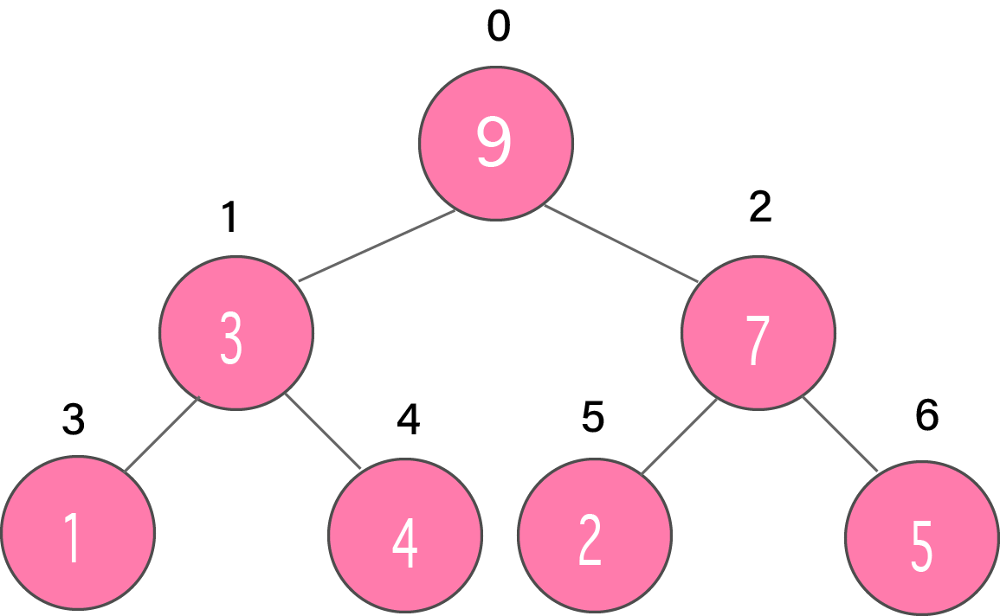
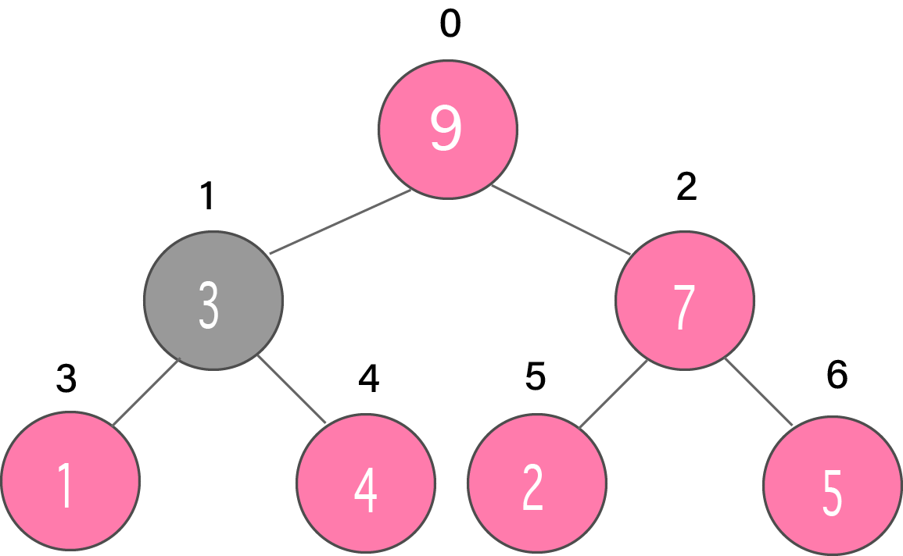
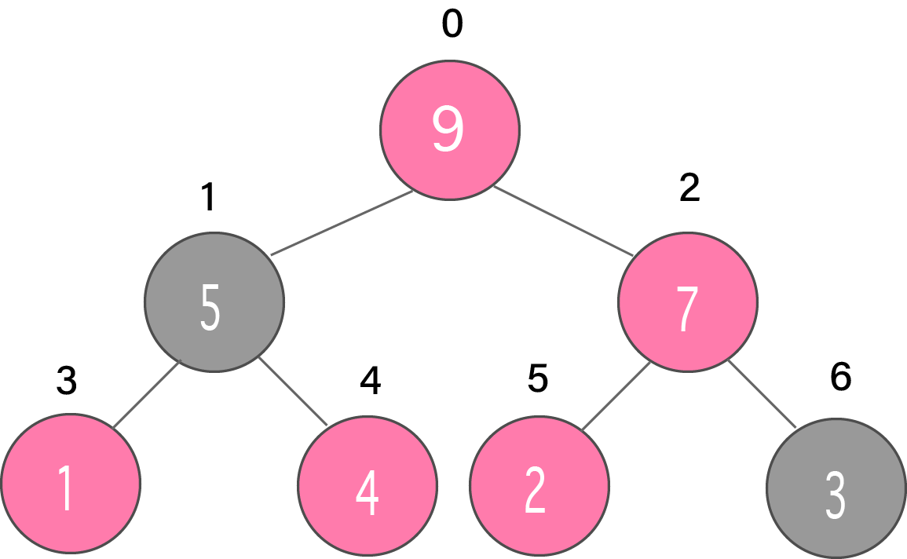
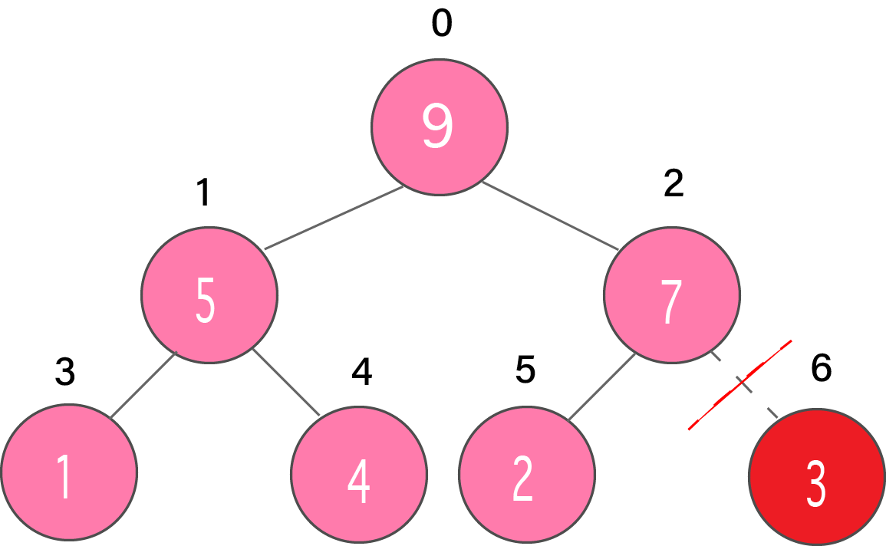
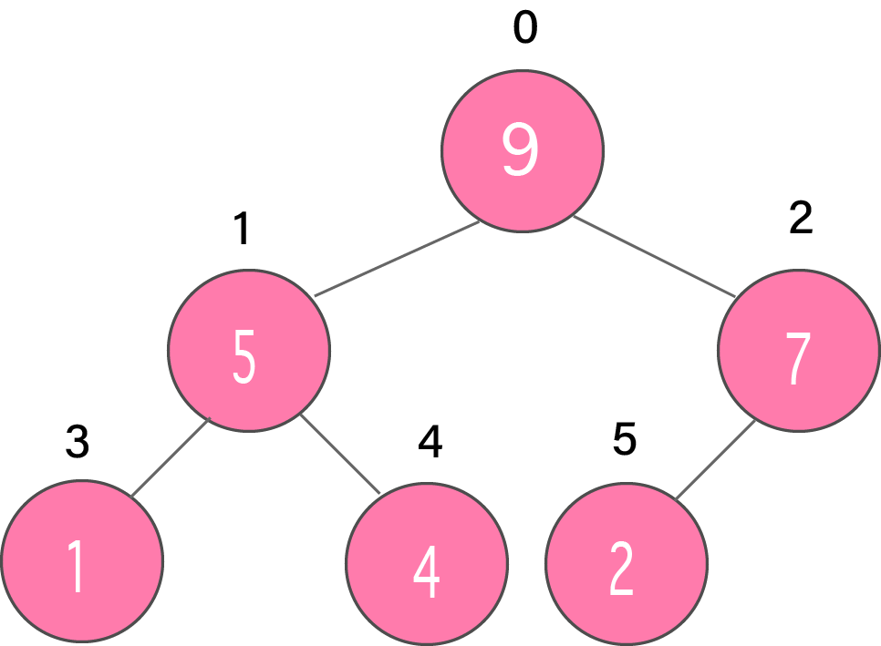

# Priority Queue | 우선순위 큐
`우선순위 큐`는 큐 안의 각 요소가 우선순위와 연관되고 우선순위에 따라 처리되는 특별한 유형의 큐이다. 우선순위가 동일한 요소가 존재하는 경우에는 큐 안의 순서에 따른다.

일반적으로 요소 자체의 값이 우선순위를 할당하기 위해 고려된다.

예를 들어, 값이 가장 큰 요소를 가장 높은 우선순위 요소로 간주하거나, 반대로 값이 가장 작은 요소를 가장 높은 우선순위 요소로 가정할 수 있다. 이 외에도, 필요에 따라 우선순위를 정할 수 있다.

## 우선순위 큐와 일반 큐의 차이점
`큐`에서는 **선입선출(FIFO)** 규칙이 적용되는 반면 `우선순위 큐`에서는 **우선순위에 따라** 값이 삭제된다. 우선순위가 가장 높은 요소가 먼저 삭제된다.

## 우선순위 큐의 구현
`우선순위 큐`는 `배열`, `연결 리스트`, `힙` 자료 구조 또는 `이진 탐색 트리`를 이용하여 구현할 수 있다. 이러한 자료 구조들 중 **힙** 자료 구조를 이용하면 우선순위 큐를 효율적으로 구현할 수 있다.

따라서, 힙 자료 구조를 이용하여 우선순위 큐를 구현해보자.. 

## 우선순위 큐 연산
우선순위 큐의 기본 연산은 요소의 삽입, 삭제, 조회이다.

### 우선순위 큐에 요소 삽입하기
우선순위 큐(ex. 최대 힙(max-heap))에 요소를 삽입하는 과정은 아래와 같이 진행된다.
- 트리의 맨 끝에 새 요소를 삽입한다.

  

- 트리를 Heapify한다.

  

### 우선순위 큐에서 요소 삭제하기
우선순위 큐(ex. 최대 힙(max-heap))의 요소 삭제는 다음과 같이 이루어진다.
- 삭제할 요소를 선택한다.

  
- 마지막 요소와 교환한다.

  

- 마지막 요소를 삭제한다.

  

- 트리를 Heapify한다.

  

### 우선순위 큐에서 우선순위가 가장 높은 값 조회하기
최대 힙에서는 최대 값을, 최소 힙에서는 최소 값을 반환한다.
두 경우 모두 루트 노드를 반환하면 된다.

## 우선순위 큐의 응용
- 다익스트라 알고리즘
- 스택 구현
- 운영 체제의 로드 밸런싱 및 인터럽트 처리용
- 허프만 부호 데이터 압축용

## Reference
- https://www.programiz.com/dsa/priority-queue