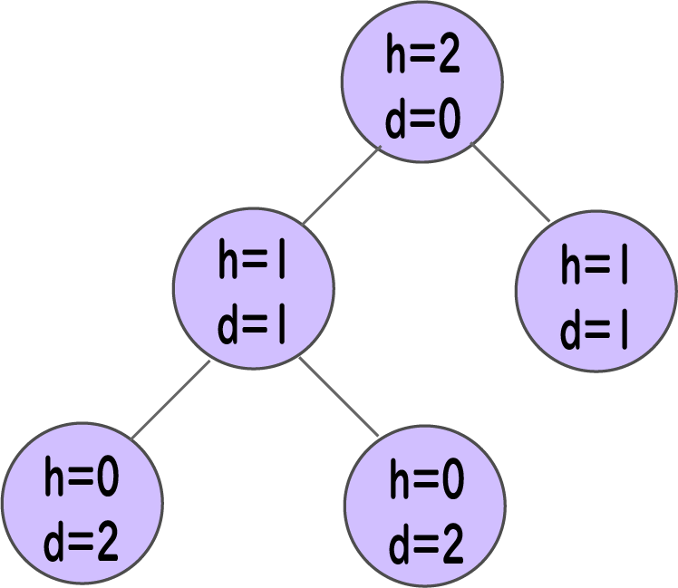

# Tree | 트리
```트리```는 **간선**으로 연결된 **노드**들로 구성되는 **비선형 계층적** 자료 구조이다.

## 왜 트리 자료 구조를 사용하는가?
배열, 연결 리스트, 스택, 그리고 큐와 같은 다른 자료 구조들은 선형 데이터를 순차적으로 저장하는 자료 구조이다. 선형 자료 구조에서 어떤 연산을 수행하기 위해서는 시간 복잡도가 데이터 크기에 따라 증가한다. 그러나 이는 오늘날의 컴퓨터 세계에서는 허용되지 않는다.

트리 자료 구조는 비선형 자료 구조로서 데이터에 **더 빠르고 쉬운 접근**을 가능하게 한다.

## 트리 용어
- Node | 노드
```
노드는 트리의 구성 요소에 해당한다. 키 또는 값과 자식 노드에 대한 포인터를 포함하는 개체이다.

각 경로의 마지막 노드들은 잎사귀 노드(leaf node) 또는 자식 노드로의 연결/포인터를 포함하지 않는 외부 노드(external node)라고 부른다.

적어도 하나 이상의 자식 노드를 갖는 노드는 내부 노드(internal node)라고 한다.
```

- Edge | 간선
```
노드와 노드를 연결하는 연결선이다.
```


- Root | 루트
```
트리 구조에서 최상위에 존재하는 노드
```

- Height of a Node | 노드의 높이
```
노드로부터 가장 깊은 잎사귀 노드까지의 간선 수 (ie. 노드에서 잎사귀 노드까지 가장 긴 경로)
```

- Depth of a Node | 노드의 깊이
```
루트 노드에서 노드까지의 간선 수
```


- Height of a Tree | 트리의 높이
```
루트 노드의 높이
```

- Degree of a Node | 노드의 차수
```
해당 노드의 총 가지 수
```

## 트리의 종류
1. Binary Tree | 이진 트리
1. Binary Search Tree | 이진 탐색 트리
1. AVL Tree
1. B-Tree 

## 트리 순회
트리 연산을 수행하려면 특정 노드에 도달해야 한다. 트리 순회 알고리즘은 트리의 필수 노드를 방문하는 데 도움이 된다.

## 트리 응용 프로그램
```이진 탐색 트리(BST)```는 요소가 집합에 **존재하는지** 여부를 빠르게 확인하기 위해 사용된다.

```힙(Heap)```은 **힙 정렬**에 사용되는 트리의 일종이다.

트리의 변형된 버전인 ```트라이(Trie)```는 **라우팅 정보**를 저장하기 위해 현대 라우터에서 사용된다.

대부분의 인기 있는 **데이터베이스**는 ```B-Tree```와 ```T-Tree```를 사용하며, 이것은 우리가 배운 트리 구조의 변형이다. 

**컴파일러**들은 작성하는 모든 프로그램의 구문을 검증하기 위해 ```구문 트리(Syntax Tree)```를 사용한다.


## Reference
- https://www.programiz.com/dsa/trees