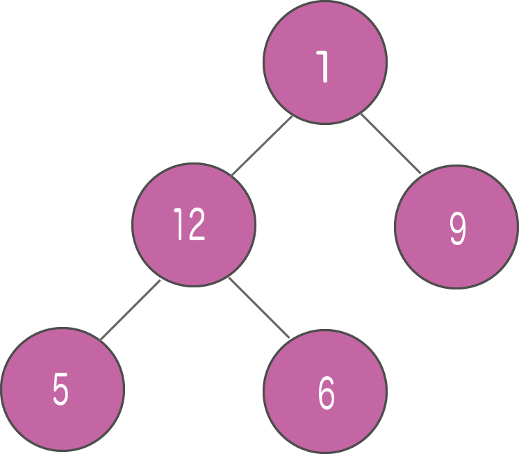
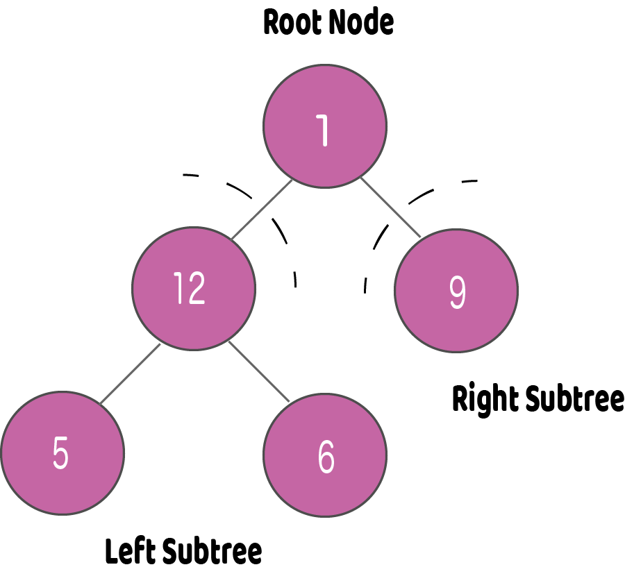
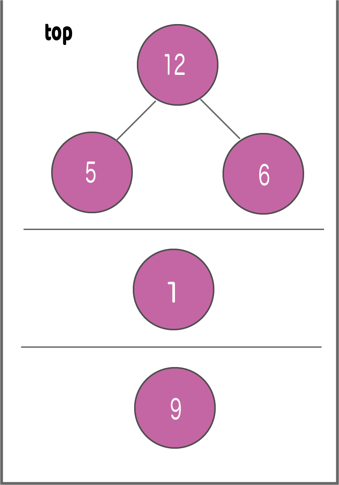
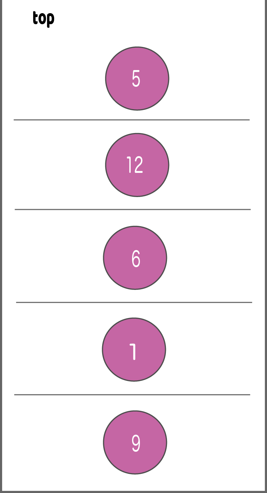

# Tree Traversal - inorder, preorder and postorder
트리 순회 방법에는 3가지가 있다. 
1. 중위 순회 (inorder)
2. 전위 순회 (preorder)
3. 후위 순회 (postorder)

트리 순회는 트리의 모든 노드를 방문하는 것을 의미한다. 예를 들어, 트리의 모든 값을 더하거나 가장 큰 값을 찾고 싶을 수 있다. 이러한 모든 작업을 수행하려면 트리의 모든 노드를 방문하여야 한다.

배열, 스택, 큐, 연결 리스트와 같은 선형 자료 구조들은 데이터를 조회하기 위한 방법을 오직 한 가지만 가지고 있다. 그러나 트리와 같은 계층적 자료 구조는 여러 방식으로 순회할 수 있다.


<br><br>

위 이미지의 트리의 요소를 어떻게 읽을지 생각해보자.

위에서 시작하여 왼쪽에서 오른쪽으로.
```
1 -> 12 -> 5 -> 6 -> 9
```

아래에서 시작하여 왼쪽에서 오른쪽으로.
```
5 -> 6 -> 12 -> 9 -> 1
```

이 과정은 다소 쉬우나 트리의 계층은 고려하지 않고 노드의 깊이만 고려한다.
대신, 트리의 기본 구조를 고려한 순회 방법을 사용하자.

```python
class Node:
    def __init__(self, item):
        self.left = None
        self.right = None
        self.val = item
```

```left```와 ```right```가 가리키는 노드는 각각 또 다른 왼쪽, 오른쪽 노드를 가질 수 있기 때문에 그들을 하위 노드가 아닌 하위 트리로 생각해야 한다.

이 구조에 따르면, 모든 트리는 아래의 조합이다.
- 데이터를 갖는 노드
- 두 개의 하위 트리

우리의 목표는 각 노드를 방문하는 것이므로 하위 트리의 모든 노드를 방문하고, 루트 노드를 방문하고, 오른쪽 하위 트리의 모든 노드를 방문해야 하는 것을 기억하자.

방문하는 순서에 따라 세 가지 종류의 순회가 있을 수 있다.

## Inorder traversal | 중위 순회
1. 먼저 **왼쪽 하위 트리**의 모든 노드를 방문한다.
1. 그리고 **루트** 노드를 방문한다.
1. **오른쪽 하위 트리**의 모든 노드를 방문한다.

```
inorder(root->left)
display(root->data)
inorder(root->right)
```

## Preorder traversal | 전위 순회
1. **루트** 노드 방문
1. **왼쪽 하위 트리**의 모든 노드 방문
1. **오른쪽 하위 트리**의 모든 노드 방문

```
display(root->data)
preorder(root->left)
preorder(root->right)
```

## Postorder traversal | 후위 순회
1. **왼쪽 하위 트리**의 모든 노드 방문
1. **오른쪽 하위 트리**의 모든 노드 방문
1. **루트** 노드 방문

```
postorder(root->left)
postorder(root->right)
display(root->data)
```

중위(Inorder) 순회를 시각화해보자. 루트 노드로부터 시작한다.



<br><br>

우리는 먼저 왼쪽 하위 트리를 순회한다. 우리는 또한 이 트리의 순회가 끝나면 루트 노드를, 그 다음에 오른쪽 하위 트리를 방문해야 하는 것을 기억해야 한다.

기억할 수 있도록 이 모든 것을 스택에 쌓아두자.


<br><br>

이제 우리는 스택의 TOP이 가리키는 하위 트리를 순회한다.

다시 동일한 중위 순회의 규칙을 따른다.

```
Left subtree -> root -> right subtree
```

왼쪽 하위 트리를 순회한 후, 마지막 스택은 아래 이미지와 같다.


<br><br>

노드 "5"에는 하위 트리가 없기 때문에 바로 이를 출력한다. 그 후 그것의 부모 노드 "12"를 출력하고 오른쪽 자식 노드 "6"를 출력한다.

루트 노드의 왼쪽 하위 트리가 순회되었으니 출력해서 오른쪽 하위 트리로 갈 수 있기 때문에 모든 것을 스택에 올려 놓는 것이 도움이 되었다.

모든 요소들을 지나간 후, 다음과 같은 중위 순회를 얻는다.

```
5 -> 12 -> 6 -> 1 -> 9
```

재귀가 올바른 순서를 유지하기 때문에 우리가 직접 스택을 생성할 필요는 없다.

## 코드 예시
```python
# Tree traversal in Python
class Node:
    def __init__(self, item):
        self.left = None
        self.right = None
        self.val = item

def inorder(root):
    if root:
        # Traverse left
        inorder(root.left)
        # Traverse root
        print(str(root.val), end=' ')
        # Traverse right
        inorder(root.right)


def postorder(root):
    if root:
        # Traverse left
        postorder(root.left)
        # Traverse right
        postorder(root.right)
        # Traverse root
        print(str(root.val), end=' ')


def preorder(root):
    if root:
        # Traverse root
        print(str(root.val), end=' ')
        # Traverse left
        preorder(root.left)
        # Traverse right
        preorder(root.right)


root = Node(1)
root.left = Node(2)
root.right = Node(3)
root.left.left = Node(4)
root.left.right = Node(5)

print("Inorder traversal ")
inorder(root)

print("\nPreorder traversal ")
preorder(root)

print("\nPostorder traversal ")
postorder(root)
```
Output:
```bash
Inorder traversal 
4 2 5 1 3 
Preorder traversal 
1 2 4 5 3 
Postorder traversal 
4 5 2 3 1 
```

## Reference
- https://www.programiz.com/dsa/tree-traversal