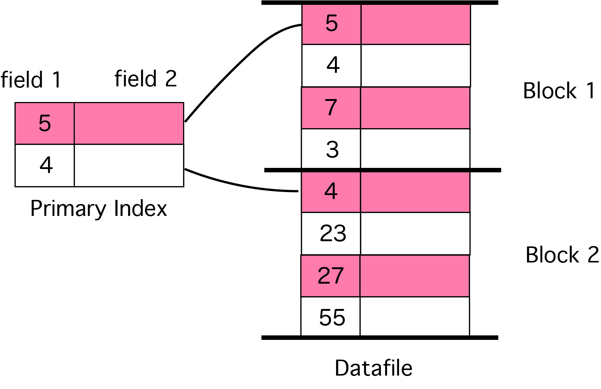

# Indexing in Databases
## What is Indexing?
인덱싱은 쿼리가 처리될 때 필요한 디스크 액세스 수를 최소화하여 데이터베이스 성능을 최적화하는 방법이다. 데이터베이스에서 데이터를 빠르게 찾고 액세스하는 데 사용되는 데이터 구조 기술이다.

## Single-level Indexing
1. Primary Indexing
2. Clustering Indexing
3. Secondary Indexing

**Primary Indexing**은 데이터 파일의 기본 키에 주로 정의되며 데이터 파일은 기본 키를 기반으로 이미 정렬되어 있다.

**Primary Index**는 두 필드를 갖는 고정 길이의 레코드를 갖는 정렬된 파일이다. 인덱스의 첫 번째 필드는 정렬된 방식으로 데이터 파일의 기본 키를 복제하고, 정렬된 파일의 두 번째 필드에는 키가 포함된 레코드를 사용할 수 있는 데이터 블록을 가리키는 포인터가 있다. 

각 블록의 첫 번째 레코드를 앵커 레코드 또는 블록 앵커라고 한다. 데이터 파일의 모든 블록에 대한 레코드가 primary index 파일에 존재한다. 

Primary index를 사용하는 평균 블록 수는 `log2B+1` 이다. (여기서 B는 인덱스 블록 수)


<br><br>

**Secondary Index**는 후보 키이고 모든 레코드에 고유한 값이 있는 필드 또는 중복 값이 있는 키가 아닌 필드에서 생성될 수 있다.

**Clustering Index**는 정렬된 데이터 파일에 정의된다. 데이터 파일은 키가 아닌 필드에서 정렬된다.

정렬된 인덱싱에는 두 가지 유형이 있다.
* Dense Index
* Sparse Index

### Dense Index
Dense Index는 데이터베이스의 모든 검색 키 값에 대해 인덱스 레코드를 갖는다. 이는 검색을 빠르게 하지만 인덱스 레코드를 저장하기 위한 더 많은 공간을 필요로 한다. 인덱스 레코드는 검색 키 값과 디스크 상의 실제 레코드를 가리키는 포인터를 포함한다.

### Sparse Index
Sparse Index는 인덱스 레코드가 모든 검색 키에 대해서 생성되지 않는다. 여기서 인덱스 레코드는 검색 키와 디스크 상의 데이터를 가리키는 포인터를 포함한다. 레코드를 검색하기 위해, 먼저 인덱스 레코드로 진행하고 데이터의 실제 위치에 도달한다. 인덱스를 따름으로써 찾고 있는 데이터에 직접적으로 도달하지 못한다면 데이터를 찾을 때까지 시스템은 순차 검색을 시작한다.

## Multilevel Indexing
1. B Trees (Balanced Trees..)
2. B+ Trees

인덱스 레코드는 검색 키 값과 데이터 포인터로 구성된다. **Multilevel Index**는 실제 데이터베이스 파일과 함께 디스크에 저장된다. 데이터베이스의 크기가 커지면서, 인덱스들의 크기도 커진다. 검색 작업의 속도를 높이기 위해 인덱스 레코드를 주 메모리에 보관해야 할 필요성이 매우 크다. single-level index가 사용하면 대용량 인덱스를 메모리에 보관할 수 없으므로 여러 디스크 액세스가 발생한다.

Multilevel Index는 인덱스를 여러 개의 작은 인덱스로 분할하여 가장 바깥쪽 레벨을 메인 메모리의 어느 곳에서나 쉽게 수용할 수 있는 단일 디스크 블록에 저장할 수 있음 만큼 작게 만든다. 

### B-Tree Index
B-Tree Index는 "Balanced Tree"를 의미하며 관계형 데이터베이스에서 생성할 수 있는 인덱스 유형이다.

Oracle 데이터베이스에서 본 가장 일반적인 인덱스 유형이며 기본 인덱스 유형이다. 즉, `CREATE INDEX` 문에 수정자를 추가하지 않으면 B-Tree Index가 생성된다.

### How Does a B-Tree Index Work?
B-Tree Index는 계층 구조에 일련의 노드를 생성하여 작동한다. 이는 종종 루트, 가지, 많은 잎사귀를 갖고 있는 나무와 비교된다.

ID가 109인 레코드를 찾는 예시를 사용하겠다.

이 레코드를 찾는 단계는 다음과 같다.
1. 루트 노드에서 시작해서 첫 번째 레벨로 간다.
2. 값 109에 걸쳐있는 값 범위를 포함하는 노드를 찾는다. (예: 100에서 200사이의 범위)
3. 이 노드로부터 두 번째 레벨로 이동한다.
4. 값 109에 걸쳐있는 값 범위를 포함하는 노드를 찾는다. (예: 100에서 120사이의 범위)
5. 이 노드로부터 세 번째 레벨로 이동한다.
6. ID가 109인 레코드를 찾는다.

값의 범위를 찾고 다음 레벨로 이동한다. 이는 알맞은 행을 찾을 때까지 몇 번 반복된다.

### How Can I Create a B-Tree Index?
Oracle에서 B-Tree Index를 생성하려면, `CREATE INDEX` 명령을 사용할 수 있다.
```sql
CREATE INDEX index_name ON table_name (columns)&nbsp;
```
`CREATE INDEX`문을 작성할 때 B-Tree Index를 생성한다면 타입을 명시할 필요가 없다. 기본으로 인덱스는 B-Tree Index로 생성된다.
* `index_name`: 생성하려는 인덱스의 이름
* `table_name`: 인덱스가 생성될 테이블의 이름
* `columns`: 인덱스가 생성될 컬럼들의 콤마로 구분된 리스트. 하나 이상의 컬럼을 명시할 수 있다.

### What Should I Name My Index?
생성할 모든 인덱스는 이름이 필요하며, 이름은 고유해야 한다.

인덱스 이름을 지정하는 방법으로 추천하는 것은 `ix_table_columns`이다.

`ix`는 index를 뜻하는 prefix이다. 

예를 들어, `ix_emp_fname`으로 인덱스 이름을 지을 수 있다. 이는 employee 테이블, first_name 컬럼 인덱스를 가리킨다.

## Advantages of Indexing
* I/O 감소, 적은 I/O
* SELECT 쿼리 속도 개선
* 빠른 데이터 액세스
* 중복 방지 (primary, unique)

## Disadvantages of Indexing
* 인덱스는 물리적으로 디스크에 공간을 차지하기 때문에 인덱스를 사용하면 추가 디스크 비용이 증가한다.
* 일반적으로 인덱스는 Select 쿼리 성능을 향상시키고 DML(Insert, Update, Delete) 성능을 저하시킨다. 특히 너무 많은 DML 연산이 수행되는 테이블에서는 인덱스가 사용되지 않아야 한다.
* 인덱스를 사용할 때 데이터베이스의 유지 로드가 증가하기 때문에 데이터베이스는 추가 로드가 발생한다. 

## Reference
* https://www.geeksforgeeks.org/primary-indexing-in-databases/
* https://www.tutorialspoint.com/dbms/dbms_indexing.htm
* https://dzone.com/articles/a-guide-to-the-b-tree-index