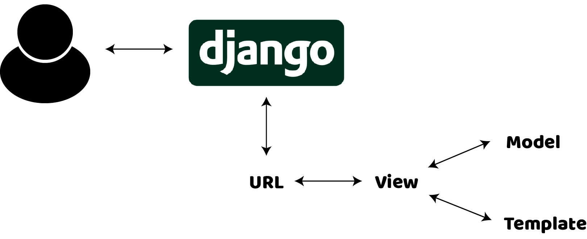

# About Django.. 

## Django란?
**Django**는 빠른 개발과 깔끔하고 실용적인 디자인을 장려하는 고수준 **Python 웹 프레임워크**이다. 숙련된 개발자가 구축하여 웹 개발의 번거로움을 상당 부분 덜어주므로 앱 작성에 집중할 수 있다. 무료이며 **오픈 소스**이다.

## 왜 Django인가?
* Ridiculously fast / 매우 빠르다.
    * Django는 개발자가 가능한 한 빠르게 개념에서 완성까지 애플리케이션을 사용할 수 있도록 설계되었다.
* Fully loaded / 완전히 적재되었다.
    * Django에는 일반적인 웹 개발 작업을 처리하는 데 사용할 수 있는 수십 가지 추가 기능이 포함되어 있다. Django는 사용자 인증, 콘텐츠 관리, 사이트 맵, RSS 피드 및 더 많은 작업을 즉시 처리한다.
* Reassuringly secure / 안심할 수 있다.
    * Django는 보안을 중요하게 생각하며 개발자가 SQL 삽입, 교차 사이트 스크립팅, 교차 사이트 요청 위조 및 클릭 재킹과 같은 일반적인 보안 실수를 방지할 수 있도록 도와준다. 사용자 인증 시스템은 사용자 계정과 암호를 관리하는 안전한 방법을 제공한다.
* Exceedingly scalable / 확장성이 뛰어나다.
    * 세계적으로 가장 바쁜 사이트 중 일부는 Django의 기능을 사용하여 가장 많은 트래픽 수요를 충족하기 위해 빠르고 유연하게 확장하고 있다.
* Incredibly versatile / 놀랍도록 다재다능하다.
    * 회사, 조직 및 정부는 Django를 사용하여 콘텐츠 관리 시스템에서 소셜 네트워크, 과학 컴퓨팅 플랫폼에 이르기까지 모든 종류의 것을 구축해왔다.

## Django를 사용하는 잘 알려진 곳들
* Instagram
* Mozilla
* The Washington Post
* Bitbucket
* Spotify
* Dropbox
* Pinterest
* Reddit

## Django Architecture
Django는 **MVT**(Model-View-Template) 아키텍처 기반이다. MVT는 웹 애플리케이션 개발을 위한 하나의 소프트웨어 디자인 패턴이다. MVT 구조는 다음 세 부분으로 구성된다. 

* **Model**: 모델은 데이터의 인터페이스 역할을 한다. 전체 애플리케이션의 논리적 데이터 구조이며 데이터베이스(Mysql, Postgres와 같은 관계형 데이터베이스)로 표시된다.

* **View**: 뷰는 비즈니스 로직을 실행하고 모델과 상호 작용하여 데이터를 운반하고 템플릿을 렌더링하는 데 사용된다.

* **Template**: 템플릿은 사용자 인터페이스 부분을 완전히 처리하는 프레젠테이션 계층이다. 

별도의 컨트롤러가 없으며 완전한 애플리케이션은 모델, 뷰, 그리고 템플릿을 기반으로 한다. 그래서 MVT 애플리케이션이라고 불린다.

  

  

여기서 사용자는 Django에 자원을 요청하고, Django는 controller처럼 작동하여 URL에 가능한 자원을 확인한다. 

URL이 매핑된다면, view가 호출되어 모델, 템플릿과 상호 작용하고, 템플릿을 렌더링한다.

Django는 사용자에게 돌아가 응답하고, 응답으로서 템플릿을 전송한다.

## Django Model
To be continued..

## Reference
- https://www.djangoproject.com/
- https://djangostars.com/blog/why-we-use-django-framework/
- https://www.geeksforgeeks.org/django-basics/
- https://www.javatpoint.com/django-mvt