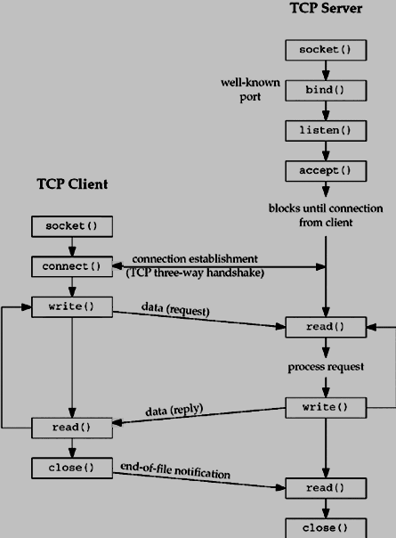

# Client Server Model
대부분의 Net 애플리케이션은 클라이언트-서버 아키텍처를 사용하는데, 이는 두 개의 프로세스 또는 일부 정보를 교환하기 위해 서로 통신하는 두 개의 애플리케이션을 의미한다. 두 프로세스 중 하나는 클라이언트 프로세스로 작동하고 다른 프로세스는 서버로 작동한다.

## Client Process
클라이언트 프로세스는 일반적으로 정보를 요청하는 프로세스이다. 응답을 받은 후 이 프로세스는 종료되거나 다른 처리를 수행할 수 있다.

예를 들어 인터넷 브라우저는 하나의 HTML 웹 페이지를 얻기 위해 웹 서버에 요청을 보내는 클라이언트 애플리케이션으로 작동한다. 

## Server Process
서버 프로세스는 클라이언트로부터 요청을 받는 프로세스이다. 클라이언트로부터 요청을 받은 후 이 프로세스는 필요한 처리를 수행하고 요청된 정보를 수집하여 요청한 클라이언트로 보낸다. 완료되면 다른 클라이언트에게 서비스를 제공할 준비가 된다. 서버 프로세스는 항상 경각심을 갖고 들어오는 요청을 처리할 준비가 되어 있다.

예를 들어, 웹 서버는 인터넷 브라우저의 요청을 계속 대기하고 브라우저에서 요청을 받는 즉시 요청된 HTML 페이지를 선택하여 해당 브라우저로 다시 보낸다.

클라이언트는 서버의 주소를 알아야 하지만 서버는 연결이 설정되기 전에 주소나 클라이언트의 존재를 알 필요가 없다. 연결이 설정되면 양쪽에서 정보를 주고 받을 수 있다.

## 2-tier and 3-tier architectures
클라이언트-서버 아키텍처에는 두 가지 유형이 있다.
* 2-tier architecture
    * 이 아키텍처에서 클라이언트는 서버와 직접 상호 작용한다. 이러한 유형의 아키텍처에는 몇 가지 보안 허점과 성능 문제가 있을 수 있다. Internet Explorer와 Web Server는 2-tier 아키텍처에서 작동한다. 여기서 보안 문제는 SSL(Secure Socket Layer)을 사용하여 해결된다.
* 3-tier architecture
    * 이 아키텍처에서는 클라이언트와 서버 사이에 하나 이상의 소프트웨어가 있다. 이 미들 소프트웨어를 '미들웨어'라고 한다. 미들웨어는 부하가 높은 경우 모든 보안 검사 및 부하 분산을 수행하는 데 사용된다. 미들웨어는 클라이언트로부터 모든 요청을 받고 필요한 인증을 수행한 후 해당 요청을 서버로 전달한다. 그런 다음 서버는 필요한 처리를 수행하고 응답을 미들웨어로 다시 보내고 마지막으로 미들웨어는 이 응답을 클라이언트에 다시 전달한다. 3-tier 아키텍처를 구현하려면 웹 서버와 웹 브라우저 사이에 Web Logic 또는 WebSphere 소프트웨어와 같은 미들웨어를 유지할 수 있다.

## Types of Server
서버에는 두 가지 유형이 있다.
* **Iterative Server**
    * 서버 프로세스가 하나의 클라이언트에 서비스를 제공하고 첫 번째 요청을 완료한 후 다른 클라이언트의 요청을 받는 가장 간단한 형태의 서버이다. 다른 클라이언트는 계속 대기하고 있다.
* **Concurrent Servers**
    * 이 유형의 서버는 한 프로세스가 더 오래 걸리고 다른 클라이언트가 너무 오래 기다릴 수 없기 때문에 한 번에 많은 요청을 처리하기 위해 여러 동시 프로세스를 실행한다. Unix에서 동시 서버를 작성하는 가장 간단한 방법은 자식 프로세스를 포크하여 각 클라이언트를 개별적으로 처리하는 것이다.

## How to Make Client
연결을 설정하기 위한 시스템 호출은 클라이언트와 서버에 대해 다소 다르지만 둘 다 소켓의 기본 구성을 포함한다. 두 프로세스 모두 자체 소켓을 설정한다. 

클라이언트 측에서 소켓을 설정하는 단계는 다음과 같다.
* `socket()` 시스템 호출로 소켓을 생성한다.
* `connect()` 시스템 호출을 사용하여 소켓을 서버 주소에 연결한다.
* 데이터를 보내고 받는다. 이를 수행하는 방법에는 여러 가지가 있지만 가장 간단한 방법은 `read()` 및 `write()` 시스템 호출을 사용하는 것이다.

## How to Make a Server
서버 측에 소켓을 설정하는 단계는 다음과 같다.
* `socket()` 시스템 호출로 소켓을 생성한다.
* `bind()` 시스템 호출을 사용하여 소켓을 주소에 바인드한다. 인터넷의 서버 소켓의 경우 주소는 호스트 시스템의 포트 번호로 구성된다.
* `listen()` 시스템 호출로 연결을 수신한다.
* `accept()` 시스템 호출로 연결을 수락한다. 이 호출은 일반적으로 클라이언트가 서버에 연결할 때까지 연결을 차단한다.
* `read()` 및 `write()` 시스템 호출을 사용하여 데이터를 보내고 받는다.

## Client and Server Interaction
다음은 완전한 클라이언트-서버 상호작용을 보여주는 다이어그램이다.

  

## Reference
* https://www.tutorialspoint.com/unix_sockets/client_server_model.htm