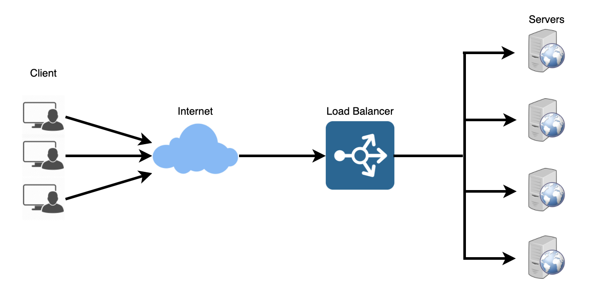
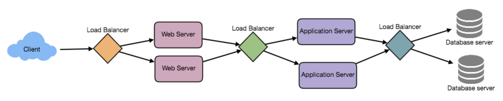
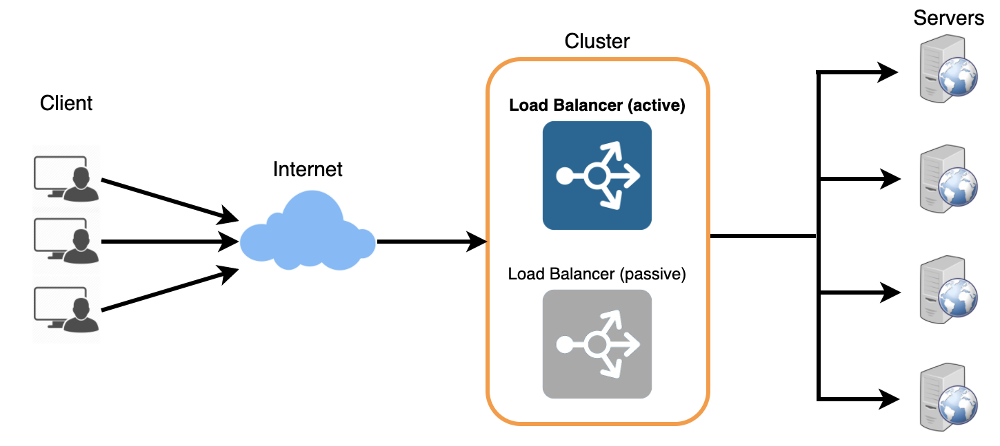

# Load Balancing
`로드 밸런서(Load Balancer)`는 분산 시스템의 중요한 구성 요소이다. 애플리케이션, 웹 사이트 또는 데이터베이스의 응답성과 가용성을 향상시키기 위해 **서버 클러스터에 트래픽을 분산**시키는 데 도움이 된다. 또한 로드 밸런서는 요청을 배포하는 동안 모든 리소스의 상태를 추적한다. 서버가 새 요청을 받을 수 없거나 응답하지 않거나 에러 발생률이 높은 경우 로드 밸런서는 해당 서버로의 트래픽 전송을 중지한다. 

일반적으로 로드 밸런서는 수신 네트워크 및 애플리케이션 트래픽을 받아들이고 다양한 알고리즘을 사용하여 여러 백엔드 서버에 트래픽을 분산하며 클라이언트와 서버 사이에 위치한다. 로드 밸런서는 여러 서버에 걸친 **애플리케이션 요청의 균형을 조정**함으로써 **개별 서버 부하를 줄이고** 하나의 애플리케이션 서버가 단일 실패 지점이 되는 것을 방지하여 **전체 애플리케이션 가용성과 응답성을 향상**시킨다.

  

완전한 확장성과 중복성을 활용하기 위해 시스템의 각 레이어에서 부하를 균형 있게 조정해볼 수 있다. 다음 3가지 위치에 로드 밸런서를 추가할 수 있다.
* 사용자와 웹 서버 사이
* 웹 서버와 내부 플랫폼 레이어(애플리케이션 서버 또는 캐시 서버) 사이
* 내부 플랫폼 레이어와 데이터베이스 사이

  

## Benefits of Load Balancing
* 사용자는 **더 빠르고 중단없는 서비스**를 경험한다. 사용자는 고군분투하는 단일 서버가 이전 작업을 완료할 때까지 기다릴 필요가 없다. 대신 즉시 사용 가능한 리소스로 요청이 전달된다.
* 서비스 제공자는 적은 정지 시간과 높은 처리량을 경험한다. 로드 밸런서가 단순히 정상적인 서버로 라우팅하기 때문에 **전체 서버 오류가 발생하더라도 최종 사용자 환경에 영향을 미치지 않는다**.
* 로드 밸런싱을 사용하면 시스템 관리자가 사용자의 대기 시간을 줄이면서 들어오는 요청을 보다 쉽게 처리할 수 있다.
* 스마트 로드 밸런서는 트래픽 병목 현상이 발생하기 전에 확인하는 예측 분석과 같은 이점을 제공한다. 결과적으로 스마트 로드 밸런서는 조직에 실행 가능한 통찰력을 제공한다. 이는 자동화의 핵심이며 비즈니스 결정을 내리는 데 도움이 될 수 있다.
* 시스템 관리자는 적은 실패 또는 덜 스트레스를 받는 구성 요소를 경험한다. 많은 작업을 수행하는 단일 장치 대신 여러 장치가 약간의 작업을 수행한다.

## Load Balancing Algorithms
### How does the load balancer choose the backend server?
로드 밸런서는 백엔드 서버로 요청을 전달하기 전에 두 가지 요소를 고려한다. 먼저, 선택한 서버가 실제로 **요청에 적절하게 응답하는지 확인**한 다음 사전에 구성된 **알고리즘을 사용하여 정상 서버 집합에서 하나를 선택**한다.

### Health Checks
로드 밸런서는 트래픽을 "healthy" 백엔드 서버로만 전달해야 한다. 백엔드 서버의 상태를 모니터링하기 위해 "health checks"는 서버가 수신 대기하는지 확인하기 위해 **정기적으로 백엔드 서버에 연결을 시도**한다. 서버가 상태 확인에 실패하면 풀에서 자동으로 제거되고 상태 확인에 다시 응답할 때까지 트래픽이 전달되지 않는다. 

필요에 따라 서로 다른 알고리즘을 사용하는 다양한 로드 밸런싱 방법이 있다.
* **Least Connection Method** — 가장 적은 활성 연결을 갖는 서버로 트래픽을 보낸다. 이 접근 방식은 서버 간에 고르지 않게 분산된 지속되는 클라이언트 연결이 많은 경우 매우 유용하다.
* **Least Response Time Method** — 활성 연결이 가장 적고 평균 응답 시간이 가장 짧은 서버로 트래픽을 보낸다.
* **Least Bandwidth Method** - 초당 메가 비트(Mbps)로 측정되는 트래픽 양을 현재 최소로 제공하고 서버를 선택한다.
* **Round Robin Method** — 서버 목록을 순환하고 각 새로운 요청을 다음 서버로 보낸다. 목록 끝에 도달하면 처음부터 다시 시작한다. 서버 사양이 같고 지속적인 연결이 많지 않을 때 가장 유용하다.
* **Weighted Round Robin Method** — 가중 라운드로빈 스케줄링은 처리 용량이 다른 서버를 더 잘 처리하도록 설계되었다. 각 서버에는 가중치(처리 용량을 나타내는 정수 값)가 지정된다. 가중치가 높은 서버는 가중치가 낮은 서버보다 먼저 새 연결을 수신하고 더 많은 연결을 얻는다.
* **IP Hash** — 클라이언트 IP주소의 해시를 계산하여 요청을 서버로 리디렉션한다.

## Redundant Load Balancers
로드 밸런서는 단일 실패 지점이 될 수 있다. 이를 극복하기 위해 두 번째 로드 밸런서를 첫 번째 로드 밸런서에 연결하여 클러스터를 형성할 수 있다. 각 로드 밸런서는 다른 로드 밸런서의 상태를 모니터링하고 두 로드 밸런서 모두 트래픽 및 장애 감지를 똑같이 제공할 수 있으므로 기본 로드 밸런서가 실패할 경우 두 번째 로드 밸런서가 인계한다.

  

## Reference
* https://www.educative.io/courses/grokking-the-system-design-interview/3jEwl04BL7Q#div-stylecolorblack-background-colore2f4c7-border-radius5px-padding5pxredundant-load-balancersdiv