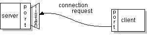

# What Is a Socket?
일반적으로 서버는 특정 컴퓨터에서 실행되며 특정 포트 번호에 바인딩된 소켓이 있다. 서버는 클라이언트가 연결 요청을 할 때까지 소켓을 들으면서 대기한다. 

소켓을 사용하면 동일하거나 다른 시스템에서 서로 다른 두 프로세스 간의 통신이 가능하다. 더 정확하게 말하면 표준 Unix 파일 디스크립터를 사용하여 다른 컴퓨터와 대화하는 방법이다. Unix에서 모든 I/O 작업은 파일 디스크립터를 쓰거나 읽음으로써 수행된다. 파일 디스크립터는 열린 파일과 연관된 정수일 뿐이며 네트워크 연결, 텍스트 파일, 터미널 또는 다른 것이 될 수 있다.

프로그래머에세 소켓은 로우레벨 파일 디스크립터처럼 보이고 동작한다. 이는 read() 및 write()와 같은 명령이 파일 및 파이프와 동일한 방식으로 소켓에서 작동하기 때문이다.

소켓은 2.1BSD에서 처음 도입되었으며 이후 4.2BSD로 현재의 형태로 개선되었다. 소켓 기능은 이제 대부분의 최신 UNIX 시스템 릴리즈에서 사용할 수 있다.

클라이언트 사이드에서: 클라이언트는 서버가 실행중인 시스템의 호스트 이름과 서버가 듣고 있는 포트 번호를 알고 있다. 연결 요청을 하기 위해 클라이언트는 서버의 컴퓨터 및 포트에 있는 서버와 만남을 시도한다. 클라이언트는 또한 서버에 자신을 식별하여 이 연결 중에 사용할 로컬 포트 번호에 바인딩해야 한다. 이는 일반적으로 시스템에서 할당한다. 

  

모든 것이 잘되면 서버는 연결을 수락한다. 수락하면 서버는 동일한 로컬 포트에 바인딩된 새 소켓을 얻고 해당 원격 엔드포인트도 클라이언트의 주소 및 포트로 설정한다. 연결된 클라이언트의 요구를 처리하면서 연결 요청을 위해 원래 소켓을 계속 리스닝할 수 있도록 새 소켓이 필요하다. 

  

클라이언트 측에서 연결이 수락되면 소켓이 성공적으로 생성되고 클라이언트는 소켓을 사용하여 서버와 통신할 수 있다. 

클라이언트와 서버는 이제 소켓에 쓰거나 소켓에서 읽는 방식으로 통신할 수 있다.

> 정의:
소켓은 네트워크에서 실행되는 두 프로그램 간의 양방향 통신 링크의 한 엔드포인트이다. 소켓은 포트 번호에 바인딩되어 있으므로 TCP 레이어는 데이터가 전송될 애플리케이션을 식별할 수 있다.

엔드포인트는 IP 주소와 포트 번호의 조합이다. 모든 TCP 연결은 두 엔드포인트에 의해 고유하게 식별될 수 있다. 이렇게 하면 호스트와 서버 간에 여러 연결을 가질 수 있다.

Java 플랫폼의 `java.net` 패키지는 Java 프로그램과 네트워크의 다른 프로그램 사이의 양방향 연결의 한 쪽을 구현하는 `Socket` 클래스를 제공한다. `Socket` 클래스는 플랫폼 의존 구현 위에 위치하여 Java 프로그램에서 특정 시스템의 세부 정보를 숨긴다. 원시 코드에 의존하는 대신 `java.net.Socket` 클래스를 사용하면 Java 프로그램이 플랫폼에 독립적인 방식으로 네트워크를 통해 통신할 수 있다.

또한 `java.net`에는 서버가 클라이언트에 대한 연결을 수신하고 수락하는 데 사용할 수 있는 소켓을 구현하는 `ServerSocket` 클래스가 포함되어 있다. 

## Where is Socket Used?
Unix 소켓은 **클라이언트-서버 애플리케이션 프레임워크**에서 사용된다. 서버는 클라이언트의 요청에 따라 일부 기능을 수행하는 프로세스이다. FTP, SMTP 및 POP3와 같은 대부분의 애플리케이션 수준 프로토콜은 소켓을 사용하여 클라이언트와 서버 간의 연결을 설정한 다음 데이터를 교환한다.

## Socket Types
사용자가 사용할 수 있는 네 가지 유형의 소켓이 있다. 처음 두 가지는 가장 일반적으로 사용되며 마지막 두 가지는 거의 사용되지 않는다.

프로세스는 동일한 유형의 소켓간에만 통신하는 것으로 간주되지만 다른 유형의 소켓 간의 통신을 방지하는 제한은 없다.

* **Stream Sockets**
    * 네트워크 환경에서의 전달이 보장된다. stream socket을 통해 세 개의 항목 "A, B, C"를 전송하면 동일한 순서 "A, B, C"로 도착한다. 이 소켓은 데이터 전송을 위해 TCP(Transmission Control Protocol)를 사용한다. 전달이 불가능한 경우 발신자는 오류 표시기를 받는다. 데이터 레코드에는 경계가 없다.
* **Datagram Sockets**
    * 네트워크 환경에서의 전달이 보장되지 않는다. stream socker에서와 같이 열린 연결을 가질 필요가 없기 때문에 연결이 없다. 목적지 정보로 패킷을 만들어 전송한다. UCP(User Datagram Protocol)을 사용한다.
* **Raw Sockets**
    * 이를 통해 사용자는 소켓 추상화를 지원하는 기본 통신 프로토콜에 액세스할 수 있다. 이러한 소켓은 일반적으로 데이터그램 지향적이지만 정확한 특성은 프로토콜에서 제공하는 인터페이스에 따라 다르다. 일반 사용자를 위한 것이 아니다. 이들은 주로 새로운 통신 프로토콜을 개발하는 데 관심이 있거나 기존 프로토콜의 좀 더 복잡한 기능에 대한 액세스 권한을 얻기 위해 제공된다.
* **Sequenced Packet Sockets**
    * 레코드 경계가 유지된다는 점을 제외하면 stream socket과 유사하다. 이 인터페이스는 NS(Network Systems) 소켓 추상화의 일부로만 제공되며 대부분의 심각한 NS 애플리케이션에서 매우 중요하다. Sequenced-packet socket을 사용하면 사용자가 보낼 데이터와 함께 프로토 타입 헤더를 작성하거나 패킷 그룹의 SPP(시퀀스 패킷 프로토콜) 또는 IDP(인터넷 데이터그램 프로토콜) 헤더를 조작할 수 있다. 모든 나가는 데이터에 사용할 기본 헤더를 지정하고 사용자가 들어오는 패킷에서 해더를 받을 수 있도록 한다.

## Reference
* https://docs.oracle.com/javase/tutorial/networking/sockets/definition.html
* https://www.tutorialspoint.com/unix_sockets/what_is_socket.htm