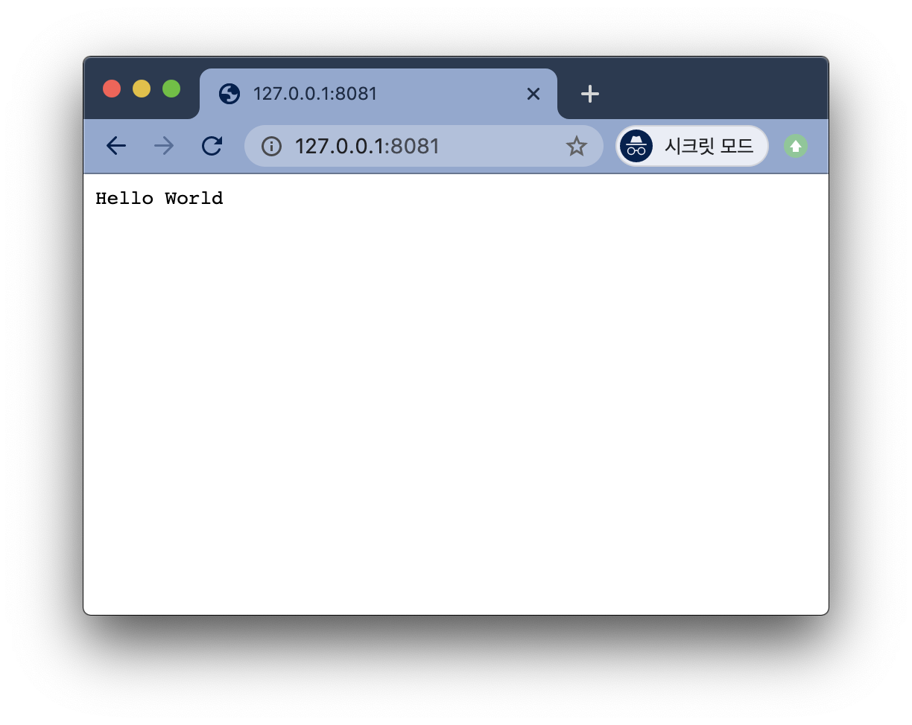

# Node.js - First Application
Node.js 애플리케이션은 다음 세 가지 컴포넌트로 구성된다.

* Import required modules / 필요한 모듈 가져오기
    * Node.js 모듈을 로드하기 위해 require directive를 사용한다.

* Create server / 서버 생성
    * Apache HTTP 서버와 같이 클라이언트의 요청을 수신할 서버를 생성한다.

* Read request and return response / 읽기 요청 및 반환 응답
    * 서버는 클라이언트에 의해 생성된 HTTP 요청을 읽는다.

## Creating Node.js Application
1. Import Required Module
    ```js
    // require 명령어를 사용하여 http 모듈 로드 및 반환된 HTTP 인스턴스를 http 변수에 저장
    var http = require("http");
    ```

2. Create Server
    ```js
    http.createServer(function (request, response) {
        // Send the HTTP header
        // HTTP Status: 200 : OK
        // Content Type: text/plain
        response.writeHead(200, {'Content-Type': 'text/plain'});

        // Send the response body as "Hello World"
        response.end('Hello World\n');
    }).listen(8081);

    // Console will print the message
    console.log('Server running at http://127.0.0.1:8081/');
    ```

3. Testing Request & Response
    1, 2 과정을 `main.js` 파일에 작성 후 HTTP 서버를 실행한다.
    ```js
    var http = require("http");

    http.createServer(function (request, response) {
        // Send the HTTP header
        // HTTP Status: 200 : OK
        // Content Type: text/plain
        response.writeHead(200, {'Content-Type': 'text/plain'});

        // Send the response body as "Hello World"
        response.end('Hello World\n');
    }).listen(8081);

    // Console will print the message
    console.log('Server running at http://127.0.0.1:8081/');
    ```

    ```bash
    # main.js 실행
    $ node main.js
    ```

* Output:
    ```bash
    Server running at http://127.0.0.1:8081/
    ```

* Node.js 서버에 요청 생성

    `http://127.0.0.1:8081/`에 접속 후 결과를 확인한다.

    
    <br><br>

## Reference
* https://www.tutorialspoint.com/nodejs/nodejs_first_application.htm