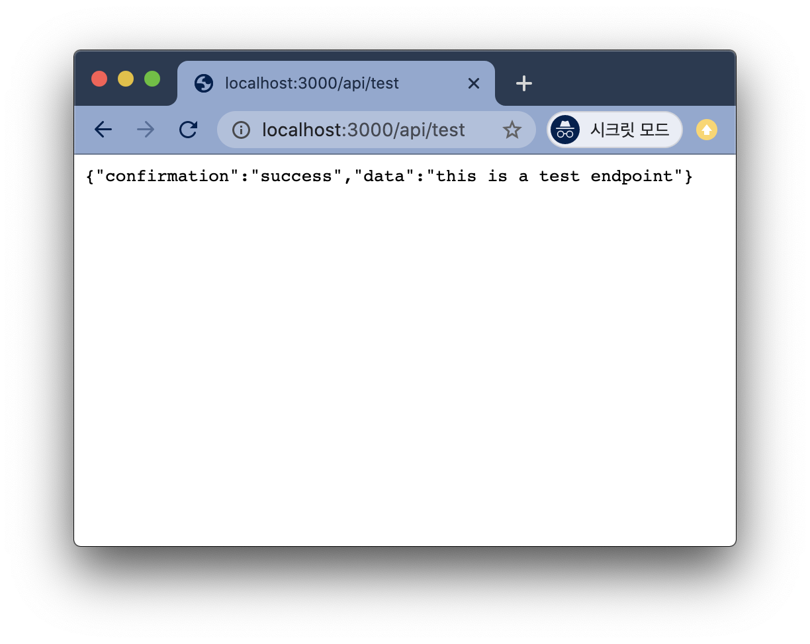
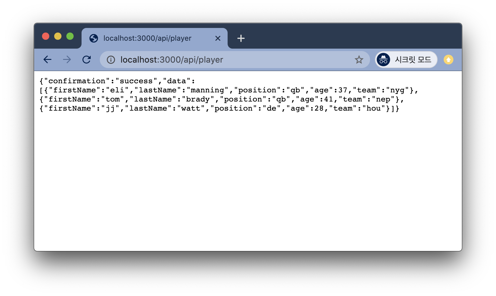
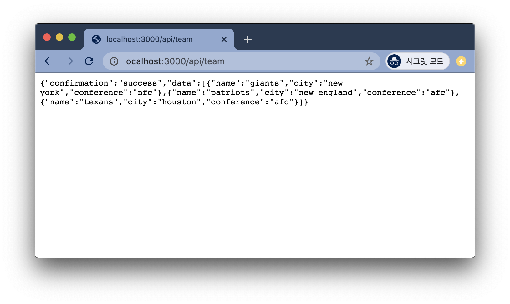
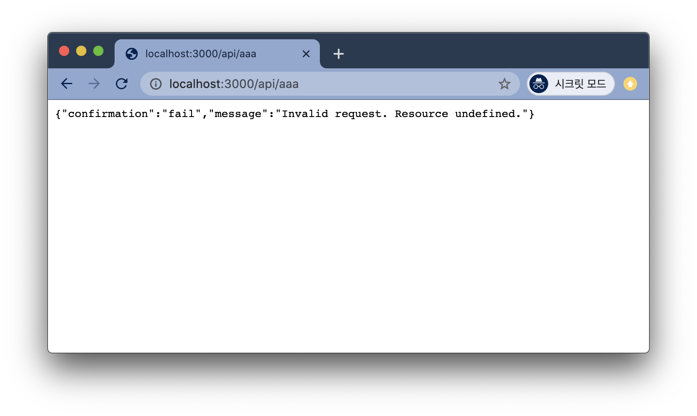

# Create a REST API With Node.JS and MongoDB

## Project setup
```bash
$ node -v
$ npm -v
$ mongo --version
$ sudo npm install -g turbo-cli
$ turbo version
# rest-api 디렉토리에 프로젝트 기본 구조 셋팅
$ turbo new rest-api

$ cd rest-api
# install dependencies as defined in the package.json
$ npm install

# run devserver
$ turbo devserver

- - - - - - - - - - - - - - -

Turbo dev server running on http://localhost:3000
Open this address in a browswer to view your project.
This is a local environment for testing and is NOT actually live on the internet.
To turn off server: CONTROL-C

- - - - - - - - - - - - - - -

# Turbo 계정 Site 생성 후 Site와 로컬 코드 연결
$ turbo login
$ turbo connect
$ turbo deploy
```

## API Route
`app.js`
```js
// import routes
const index = require('./routes/index')
const api = require('./routes/api')

// set routes
app.use('/', index) // return home page
app.use('/api', api) // sample API Routes
```

`routes/api.js`
```js
const express = require('express')
const router = express.Router()

router.get('/test', (req, res) => {
  res.json({
    confirmation: 'success',
    data: 'this is a test endpoint'
  })
})

module.exports = router
```


<br><br>

`routes/api.js`
```js
const players = [
  {firstName:"eli", lastName:"manning", position:"qb", age:37, team:"nyg"},
  {firstName:"tom", lastName:"brady", position:"qb", age:41, team:"nep"},
  {firstName:"jj", lastName:"watt", position:"de", age:28, team:"hou"}
]
const teams = [
  {name:"giants", city:"new york", conference:"nfc"},
  {name:"patriots", city:"new england", conference:"afc"},
  {name:"texans", city:"houston", conference:"afc"}
]


router.get('/player', (req, res) => {
  res.json({
    confirmation: 'success',
    data: players
  })
})

router.get('/team', (req, res) => {
  res.json({
    confirmation: 'success',
    data: teams
  })
})
```



<br><br>

위의 두 개의 분리된 엔드포인트를 request parameter인 resource 변수를 사용하여 더 일반적인 하나의 엔드포인트로 결합시킬 수 있다.

`routes/api.js`
```js
router.get('/:resource', (req, res) => {
  const resource = req.params.resource
  
  if (resource == 'team') {
    res.json({
      confirmation: 'success',
      data: teams
    })
  }

  if (resource == 'player') {
    res.json({
      confirmation: 'success',
      data: players
    })
  }
})
```


<br><br>

다음과 같이 더 간결하게 작성할 수 있다.

```js
const db = {
  teams: teams,
  player: players
}

router.get('/:resource', (req, res) => {
  const resource = req.params.resource

  const data = db[resource]
  if (data == null) {
    res.json({
      confirmation: 'fail',
      message: 'Invalid request. Resource undefined.'
    })
    return
  }
  res.json({
    confirmation: 'success',
    data: data
  })
})
```

## Mongo DB Connection
```bash
$ mongo --version
$ mkdir seed
$ cd seed
$ touch teams.json
$ touch players.json
```
`teams.json`
```json
{"name":"giants", "city":"new york", "conference":"nfc"}
{"name":"patriots", "city":"new england", "conference":"afc"}
{"name":"texans", "city":"houston", "conference":"afc"}
```
`players.json`
```json
{"firstName":"eli", "lastName":"manning", "position":"qb", "age":37, "team":"nyg"}
{"firstName":"tom", "lastName":"brady", "position":"qb", "age":41, "team":"nep"}
{"firstName":"jj", "lastName":"watt", "position":"de", "age":28, "team":"hou"}
```

```bash
# run mongodb
$ mongod --dbpath=/Users/yjlee/data/db
...
{"t":{"$date":"2020-10-01T13:00:28.001+09:00"},"s":"I",  "c":"NETWORK",  "id":23016,   "ctx":"listener","msg":"Waiting for connections","attr":{"port":27017,"ssl":"off"}}

# save db from file
$ mongoimport --db footballdb --collection players --file players.json
2020-10-01T13:02:54.425+0900	connected to: mongodb://localhost/
2020-10-01T13:02:54.469+0900	3 document(s) imported successfully. 0 document(s) failed to import.

$ mongoimport --db footballdb --collection teams --file teams.json
2020-10-01T13:03:27.205+0900	connected to: mongodb://localhost/
2020-10-01T13:03:27.242+0900	3 document(s) imported successfully. 0 document(s) failed to import.

# connect to foolball db
$ mongo footballdb
> show collections
players
teams
> db.players.find()
{ "_id" : ObjectId("5f7554ee186b42a67aaadcc5"), "firstName" : "eli", "lastName" : "manning", "position" : "qb", "age" : 37, "team" : "nyg" }
{ "_id" : ObjectId("5f7554ee186b42a67aaadcc6"), "firstName" : "jj", "lastName" : "watt", "position" : "de", "age" : 28, "team" : "hou" }
{ "_id" : ObjectId("5f7554ee186b42a67aaadcc7"), "firstName" : "tom", "lastName" : "brady", "position" : "qb", "age" : 41, "team" : "nep" }
> db.teams.find()
{ "_id" : ObjectId("5f75550f16a9ebc92863a067"), "name" : "giants", "city" : "new york", "conference" : "nfc" }
{ "_id" : ObjectId("5f75550f16a9ebc92863a068"), "name" : "patriots", "city" : "new england", "conference" : "afc" }
{ "_id" : ObjectId("5f75550f16a9ebc92863a069"), "name" : "texans", "city" : "houston", "conference" : "afc" }

```

`app.js`
```js
const config = {
  views: 'views', // Set views directory
  static: 'public', // Set static assets directory
  logging: true,
  db: {
    url: 'mongodb://localhost:27017/footballdb',
    type: 'mongo',
    onError: (err) => {
      console.log('DB Connection Failed!')
    },
    onSuccess: () => {
      console.log('FOOTBALL DB CONNECTED!')
    }
  }
}
```


## Reference
* https://www.udemy.com/course/create-a-rest-api-with-node-js-and-mongo-db/